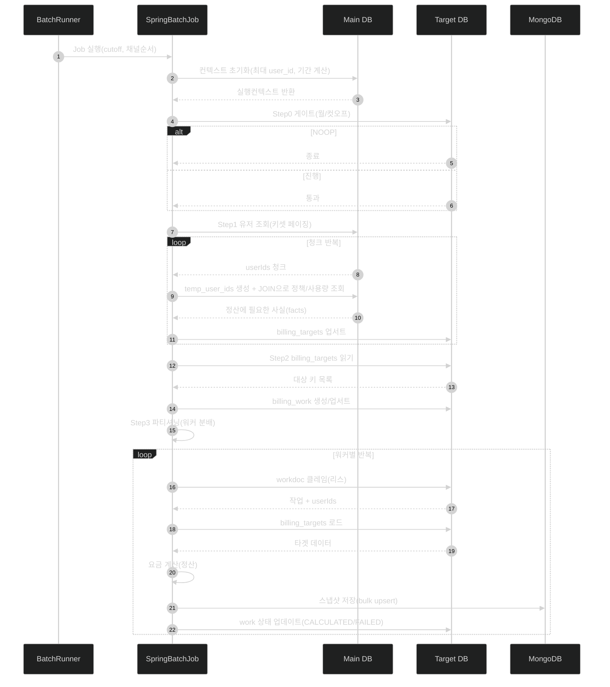
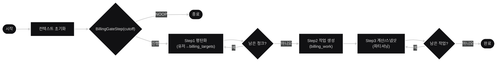
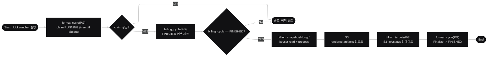
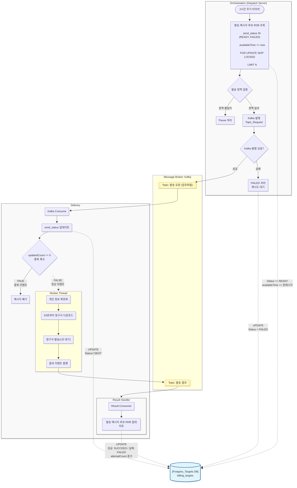

# 💼 Billing & Notification Platform

대규모 청구/정산 데이터를 기반으로 고객별 청구서를 생성하고, 메시지 발송(Email/SMS)을 **중복 없이 안정적으로 처리**하는 플랫폼입니다.  
특히 월 100만 건 이상의 정산/발송 규모를 전제로 **장애 내성**, **수평 확장**, **비용 최적화**에 초점을 맞추었습니다.

---

## 목차

1. [핵심 요구사항](#핵심-요구사항)
2. [🧠 Design Architecture](#-design-architecture)
   - [출발점: 기존 모놀리식 접근의 한계](#출발점-기존-모놀리식-접근의-한계)
   - [선택한 방향: 느슨한 결합 + 실행 단위 분리](#선택한-방향-느슨한-결합--실행-단위-분리)
   - [이벤트 기반 결합(비동기)으로 바꾼 이유](#이벤트-기반-결합비동기으로-바꾼-이유)
   - [최종 구조](#최종-구조)
   - [ERD](#erd)
   - [정리](#정리)
3. [☁️ Infrastructure Architecture](#️-infrastructure-architecture)
   - [출발점: EC2 단독 운영의 한계](#출발점-ec2-단독-운영의-한계)
   - [선택 기준: 컴포넌트마다 운영 특성이 다름름](#선택-기준-컴포넌트마다-운영-특성이-다름름)
   - [ECS/Fargate 채택 이유: 수평 확장 + 운영 단순화](#ecsfargate-채택-이유-수평-확장--운영-단순화)
   - [전부 Fargate? (혼합 전략)](#전부-fargate-혼합-전략)
   - [Trade-off](#trade-off)
   - [Monitoring](#monitoring)
   - [Lag 기반 확장 선택 이유](#lag-기반-확장-선택-이유)
   - [Lag 기반 확장 처리 방식](#lag-기반-확장-처리-방식)
   - [Monitoring 서버 + CloudWatch 메트릭 조합](#monitoring-서버--cloudwatch-메트릭-조합)
4. [⚖️ 기술 선택 근거](#️-기술-선택-근거)
   - [Message Broker: Apache Kafka](#message-broker-apache-kafka)
   - [Batch Framework: Spring Batch](#batch-framework-spring-batch)
   - [Database: PostgreSQL](#database-postgresql)
   - [Snapshot Store: MongoDB Atlas](#snapshot-store-mongodb-atlas)
   - [File Storage: Amazon S3](#file-storage-amazon-s3)
5. [⚙️ Batch 설계 전략](#️-batch-설계-전략)
   - [초기 접근: 단일 Step(Reader-Processor-Writer)](#초기-접근-단일-stepreader-processor-writer)
   - [개선 접근: Step 분리 + 상태 저장(CheckPoint) + Chunk](#개선-접근-step-분리--상태-저장checkpoint--chunk)
   - [Batch Job 구성](#batch-job-구성)
     - [Job1 - 정산 스냅샷 만들기 (결과 저장: MongoDB)](#job1---정산-스냅샷-만들기-결과-저장-mongodb)
     - [Job2 - 청구서 발송용 파일 만들기 (결과 저장: S3)](#job2---청구서-발송용-파일-만들기-결과-저장-s3)
6. [✉️ 메시지 발송(Dispatcher/Consumer) 설계 전략](#️-메시지-발송dispatcherconsumer-설계-전략)
7. [Implementation Details](#3-implementation-details)
   - [배압 제어 (Backpressure)](#️-배압-제어-backpressure)
   - [결함 내성 (Fault Tolerance)](#️-결함-내성-fault-tolerance)
   - [확장성 (Extensibility)](#-확장성-extensibility)


---

## 핵심 요구사항

- 특정일에 **전체 정산 완료**
- 고객이 정한 날짜에 고객별 청구서 발송
- 고객은 수신 거부 시간대를 설정 가능  
- 배치가 중복 실행되더라도 정산 결과가 중복 생성되지 않아야 함(멱등성)
- 발송이 중복 발송되지 않아야 함(동시성 제어)
- 실제 발송은 Mocking 처리(예: 1초 지연 후 성공, 1% 실패) + 실패 건은 재시도/대체 채널로 전환 가능

<br/>
<br/>
<br/>


## 🧠 Design Architecture


### 출발점: 기존 모놀리식 접근의 한계


초기에는 하나의 애플리케이션 안에서 정산 → 발송대상 생성 → 발송까지 모두 처리하는 형태를 고려했습니다.  
하지만 요구사항의 핵심이 **대용량 데이터 처리 + 특정 시간 슬롯 집중 + 실패/재처리**에 있었기 때문에, 단일 애플리케이션 구조는 다음 한계를 가집니다.

- **수평 확장의 어려움**
  - API 트래픽은 적어도, 발송 워커는 순간적으로 수십 배 확장이 필요할 수 있음
  - 하나의 프로세스/서비스로 묶으면 API 확장 = 워커 확장이 되어 비용과 운영이 비효율적
- **결합도가 높아 장애 전파 위험**
  - 외부 발송 지연/실패가 발생하면 같은 프로세스의 다른 기능(API/정산)까지 영향을 받기 쉬움
- **처리량 제어(Backpressure)의 어려움**
  - 발송은 외부 의존성이 커서 속도가 불안정
  - 동기 호출 기반이면 발송 병목이 전체 시스템 병목으로 전파됨
- **재처리/재시작의 운영적 불리**
  - 장애/재시도 상황에서 어디까지 처리했는지 추적과 복구가 어렵고,
  - 중복 발송/중복 처리 방지 로직이 시스템 전체에 흩어지기 쉬움

결론적으로, 대량 발송 파트에서 요구되는 **수평 확장성, 장애 격리, 처리량 완충**을 확보하려면  
모놀리식의 강한 결합을 그대로 유지하기 어렵다고 판단했습니다.

---

### 선택한 방향: 느슨한 결합 + 실행 단위 분리
그래서 도메인 모듈은 유지하되, 운영 특성이 다른 기능을 **실행/배포 단위로 분리**를 분리하는 전략을 채택했습니다.

**EventStorming**


**Domain Model**


- EventStorming과 Domain Modeling의 결과를 바탕으로
- 도메인 규칙은 DDD Bounded Context로 정리하고(`contexts/*`)
- 운영 특성이 다른 컴포넌트는 실행/배포 단위로 분리(`apps/*`)
  - API는 상시 구동(안정성/운영 단순성)
  - Dispatch는 주기 실행(슬롯 기반 선별)
  - Batch는 “작업 단위 실행”(정산/청구서 생성)
  - Delivery는 “대량 발송 처리”를 위해 0~N 수평 확장

즉, 모놀리식의 장점(도메인 정리/개발 효율)은 취하면서도  
확장이 필요한 구간만 **느슨하게 결합된 실행 단위**로 분리한 형태입니다.

---

### 이벤트 기반 결합(비동기)으로 바꾼 이유
실제 병목과 변동성이 가장 큰 구간은 **발송 처리**입니다.  
외부 발송과 상호작용하면서 지연/실패가 잦고, 처리량 요구가 순간적으로 커질 수 있습니다.

따라서, 정산/디스패치와 발송 실행을 직접 호출로 묶지 않고  
**이벤트 기반(비동기)** 으로 연결해 아래 목적을 달성했습니다.

- **발송 병목이 다른 컴포넌트로 전파되지 않게(장애 격리)**
- **버퍼를 통해 처리량을 완충(Backpressure 흡수)**
- **Delivery를 독립적으로 수평 확장(처리량 대응)**
- **장애 시에도 재처리 가능(운영 복구성)**

---

### 최종 구조
현재 구조는 **확장/격리/재처리** 목적에 맞춰 역할이 명확히 분리됩니다.

- `apps/api` (상시 구동)
  - 관리자/운영 API 제공
  - 시스템 상태 조회, 정책 관리, 운영 기능 중심

- `apps/dispatch` (주기 실행)
  - 고객 정책(수신 거부 시간대/슬롯)을 반영해 이번 슬롯 발송 대상만 선별
  - 발송 요청을 이벤트로 발행하여 Delivery와 결합도를 낮춤

- `apps/worker` (배치 실행 단위)
  - 정산/청구 데이터 생성, 청구서 파일 생성 등 대량 배치 작업을 수행
  - 상시 구동 서비스가 아니라 **필요 시 실행되는 작업 단위**로 운영됨

- `apps/delivery` (수평 확장 대상 — 발송 처리)
  - 발송 요청 이벤트를 소비하여 실제 발송 처리
  - 부하(요청 적체/Lag)에 따라 0~N으로 유연하게 확장/축소

이 구조는 **API는 안정적으로**, **Dispatch는 정책 기반으로 얇게**,  
**Batch는 재실행 가능한 작업 단위로**, **Delivery는 폭발적으로 확장 가능하게**라는
운영 요구를 그대로 반영한 결과입니다.

### ERD

<br/>

#### Main Database


#### Sub Database


---


### 정리
- **수평 확장이 필요한 구간(Worker)을 독립시키기 위해**
- **강한 결합(모놀리식)이 만드는 장애 전파를 끊기 위해**
- **발송 처리의 불확실성(지연/실패)을 버퍼로 완충하기 위해**
- **재시작/재처리 중심의 운영 안정성을 확보하기 위해**
- **도메인 경계를 유지한 채로, 향후 서비스 분리(확장) 가능성을 열어두기 위해**

<br/>
<br/>
<br/>
<br/>
<br/>


## ☁️ Infrastructure Architecture


우리 인프라 설계의 목표는 최대 트래픽을 항상 견디는 고정 서버가 아니라,  
**특정 시점에만 폭증하는 워크로드(정산/발송)를 안정적으로 흡수하면서 비용을 최소화**하는 것입니다.

---

### 출발점: EC2 단독 운영의 한계
초기에는 모든 컴포넌트를 EC2로 운영하는 단순한 구성을 고려했습니다.  
하지만 본 프로젝트는 다음 특성을 가집니다.

- **평소엔 거의 유휴, 특정 슬롯/기간에만 폭증하는 부하**
- 발송은 **컨슈머 수를 빠르게 늘려야** 처리량이 확보됨
- 장애가 나면 **재시작/재배포/스케일링을 빠르게 반복**해야 함

EC2만으로 이를 운영하면,
- 스케일 아웃을 위해 ASG/Launch Template/AMI 관리 등 운영 구성이 커짐
- **평시에도 인스턴스를 켜두는 비용**이 발생
- 스케일링/배포 속도가 느려 피크 대응 불리

---

### 선택 기준: 컴포넌트마다 운영 특성이 다름름
우리는 모든 것을 동일한 실행 환경으로 가져가지 않고,  
**역할별 운영 특성에 맞춰 실행 환경을 분리**했습니다.

- **상시 구동 & 트래픽 예측 가능**: `api-server`
- **대량 처리 & 수평 확장이 핵심**: `Delivery`
- **필요할 때만 실행되는 작업 단위**: `dispatch-server`, `worker(batch)`

이 중 특히 `consumer`는 **처리량이 수평 확장으로 결정**되는 컴포넌트라,  
오케스트레이션/스케일링이 자연스럽게 되는 환경이 필요했습니다.

---

### ECS/Fargate 채택 이유: 수평 확장 + 운영 단순화
ECS/Fargate는 컨슈머처럼 **증감이 잦은 워크로드**에 강합니다.

- **수평 확장에 최적화**
  - Task 단위로 인스턴스를 빠르게 늘리고 줄일 수 있음
  - 부하에 따라 0~N으로 유연하게 대응 가능
- **서버 관리 제거(운영 단순화)**
  - EC2처럼 OS 패치/AMI/인스턴스 용량 계획을 직접 관리하지 않아도 됨
- **배포/롤백이 빠름**
  - 이미지 기반 배포로 환경 차이를 줄이고, 실패 시 빠르게 교체 가능
- **서비스 격리**
  - 발송 처리(consumer)를 독립 서비스로 운영하여 장애가 다른 컴포넌트로 번지는 것을 최소화

결론적으로, **피크 시간에만 폭발적으로 늘어나는 발송 처리**라는 성격상  
컨슈머는 Fargate 기반이 가장 운영 효율적이라고 판단했습니다.

---

### 전부 Fargate? (혼합 전략)
우리는 **무조건 컨테이너**가 아니라, 컴포넌트 특성에 따라 혼합했습니다.

- `Delivery` : **ECS/Fargate (핵심)**
  - 수평 확장/격리/배포 속도가 가장 중요
- `dispatch-server`, `worker(batch)` : **ECS/Fargate RunTask**
  - 상시 구동이 아닌 “작업 단위 실행”에 적합
  - 스케줄 기반 실행과 결합이 쉬움
- `api-server` : **EC2**
  - 트래픽이 크지 않고 상시 구동이므로 운영 단순성을 우선
  - LB/Ingress/인증서/포트포워딩 등 배포 단순화 목적

즉, **컨슈머는 컨테이너 오케스트레이션이 반드시 필요**하지만  
**API는 굳이 과한 오케스트레이션을 강제할 필요가 없다**는 결론입니다.

---

### Trade-off
ECS/Fargate는 강점이 명확하지만, 다음 비용/제약도 있습니다.

- **세밀한 튜닝의 한계**
  - EC2처럼 커널/호스트 레벨 튜닝을 하긴 어려움
- **관측/운영 도구 구성 필요**
  - 메트릭/로그/알람을 기반으로 스케일링 기준을 잡아야 함
- **비용 구조**
  - **항상 켜두는 서버 비용**을 줄이는 대신, 사용량 기반 비용이 발생
  - 그러나 본 프로젝트는 피크 중심 워크로드이므로 합리적이라 판단

---

### Monitoring
본 프로젝트의 가장 큰 리스크는 발송 처리 구간입니다.  
발송은 외부 의존성(지연/실패)이 크고, 특정 슬롯에 요청이 몰리면 컨슈머 처리량이 곧바로 병목이 됩니다.  
따라서 장애가 났는지만 보는 수준이 아니라, **현재 시스템이 감당 가능한지(적체가 쌓이는지)** 를 판단할 수 있는 지표가 필요했습니다.

우리가 모니터링에서 얻고자 한 핵심은 3가지입니다.

- **처리 적체(Backlog) 가시화**: 지금 발송 요청이 쌓이고 있는가
- **장애 격리/복구 판단**: 컨슈머가 죽었는가, 외부 발송이 느린가
- **확장 트리거**: 언제, 얼마나 컨슈머를 늘려야 하는가

---

### Lag 기반 확장 선택 이유
일반적인 CPU/Memory 기반 오토스케일은 **이 프로젝트의 병목을 정확히 반영하지 못합니다.**

- 발송 처리는 외부 호출 지연에 의해 병목이 생기며,
  이 경우 CPU가 낮아도 처리는 느리고 적체는 증가할 가능성
- 반대로 순간적으로 CPU가 튀어도, 적체가 없다면 확장할 필요가 없음

즉, 우리가 진짜로 확장해야 하는 조건은 리소스 사용률이 아니라  
**처리해야 할 일이 얼마나 쌓였는가(Backlog)** 입니다.

Kafka를 사용하는 구조에서는 backlog가 곧 **Consumer Lag**로 나타나므로,  
Lag를 스케일 기준으로 삼는 것이 가장 직접적이고 비용 효율적인 방식이라고 판단했습니다.

---

### Lag 기반 확장 처리 방식
- 컨슈머는 토픽을 소비하며 Offset을 커밋합니다.
- 처리량이 부족하거나 외부 발송이 느려지면, 최신 Offset을 따라가지 못해 Lag가 증가합니다.
- Lag는 **현재 시스템이 처리해야 할 남은 작업량**을 직접적으로 나타내는 지표입니다.

따라서 다음과 같은은 흐름으로 확장을 설계했습니다.

1. **Lag 수집**: 특정 `consumer group`의 `total lag`를 주기적으로 측정
2. **지표화**: Lag를 메트릭(시간에 따른 수치)으로 저장
3. **알람/정책**: Lag 임계치를 기준으로 scale-out / scale-in 정책 적용
4. **결과**: 피크 시 자동으로 컨슈머가 늘고, 처리 완료 후 자동으로 줄어듦(0까지)

---

### Monitoring 서버 + CloudWatch 메트릭 조합
우리는 관측(대시보드)과 제어(오토스케일 트리거)를 분리했습니다.

- **Monitoring 서버(Grafana/Prometheus/Loki)**: 사람이 보는 용도(대시보드/로그 탐색/분석)
- **CloudWatch Metric/Alarm**: 오토스케일 트리거(알람 기반 자동 제어)

이 분리를 통해 얻는 이점은 다음과 같습니다.

- Grafana/Prometheus는 보기 좋은 관측에 강하고,
- CloudWatch Alarm은 ECS 오토스케일링과 연결이 쉬워 제어에 강합니다.

- **사람이 보는 관측은 Grafana**
- **자동 확장 제어는 CloudWatch Alarm**

이라는 역할 분리를 채택했습니다.

<br/>
<br/>
<br/>
<br/>
<br/>

## ⚖️ 기술 선택 근거

### Message Broker: Apache Kafka
단순 큐(RabbitMQ 등) 대비 높은 처리량과 신뢰성이 요구되어 카프카를 선택했습니다.

- **대용량 처리 (High Throughput):** 디스크 순차 쓰기(Sequential I/O)를 통해 수십만 건의 버스트 트래픽을 지연 없이 수용합니다.
- **장애 복구 (Replayability):** 메시지를 즉시 삭제하지 않고 보존하므로, 장애 발생 시 오프셋(Offset)을 되감아 데이터를 재처리할 수 있습니다.
- **수평적 확장성 (Scalability):** 파티션 모델을 통해 컨슈머 서버 증설만으로 병렬 처리 성능을 유연하게 확장합니다.

---

### Batch Framework: Spring Batch
본 시스템은 월 100만 건 이상의 정산/청구서 생성을 수행하며, 처리 시간이 길고 장애 가능성이 존재합니다.따라서 한 번에 끝내는 처리보다 재실행 가능성, 처리 상태 추적, 부분 복구가 가능한 배치 프레임워크가 필수입니다.
Spring Batch는 대규모 배치 처리에서 표준적으로 사용되는 프레임워크로, Step 분리/Chunk 처리/재시작(Checkpoint) 기능을 통해 운영 안정성을 확보할 수 있습니다.

- Step 기반 구조: 처리 흐름을 단계별로 분리하여 추적/운영 용이
- Chunk Processing: 대량 데이터 처리를 안정적으로 분할 처리(메모리/트랜잭션 부담 감소)
- 재시작(Checkpoint) 지원: 실패 시 전체 재실행이 아닌 “중단 지점부터 이어서 실행” 가능
- Retry/Skip 등 Fault Tolerance: 일부 오류를 허용하며 배치를 계속 진행할 수 있는 운영 옵션 제공

---

### Database: PostgreSQL
본 시스템은 단순 CRUD 작업보다 **대량 데이터 처리**, 그리고 **복잡한 집계/조건 조회**가 중요합니다.  
발송 대상 목록/정책/상태/재시도 횟수 등 다양한 조건으로 데이터를 조회·집계하며,  
특히 **중복 발송 방지**를 위해 트랜잭션(ACID) 기반의 일관성이 필수입니다.

- **ACID 트랜잭션 보장**: 중복 발송 방지에 결정적
- **복잡한 집계/조인 및 실행 제어**에 강점


- 테스트 쿼리


출처: [https://stopmin.tistory.com/entry/MySQL-vs-PostgreSQL데이터베이스의성능-및-확장성-비교](https://stopmin.tistory.com/entry/MySQL-vs-PostgreSQL%EB%8D%B0%EC%9D%B4%ED%84%B0%EB%B2%A0%EC%9D%B4%EC%8A%A4%EC%9D%98%EC%84%B1%EB%8A%A5-%EB%B0%8F-%ED%99%95%EC%9E%A5%EC%84%B1-%EB%B9%84%EA%B5%90)

---

### Snapshot Store: MongoDB Atlas
배치로 생성되는 **청구 스냅샷 데이터**는 월 단위로 대량 적재되고, 생성 이후에는 대부분 **불변(Immutable) + 조회 중심(Read-Only)** 입니다.  
이를 RDB에만 적재하면 정규화/조인 비용으로 조회 부하가 증가할 수 있어,  
본 프로젝트는 스냅샷을 문서(JSON)로 저장해 대량 조회에 유리한 **MongoDB**를 스냅샷 저장소로 채택했습니다.

- 스냅샷 저장(청구서 재완성/재발송용 입력 데이터)
- 발송 실패/재시도 처리 시 스냅샷 재조회로 재렌더 가능

---

### File Storage: Amazon S3
청구서(PDF/HTML/이미지 등)는 대용량 객체 저장에 특화된 S3에 저장하고,  
DB에는 파일 자체가 아닌 **파일 위치(S3 key)** 만 저장합니다.

- DB I/O 및 저장 비용 절감
- 파일 크기 증가에 따른 성능 저하 방지

<br/>
<br/>
<br/>
<br/>
<br/>

## ⚙️ Batch 설계 전략

### 초기 접근: 단일 Step(Reader-Processor-Writer)
하나의 Step에서 조회/처리/저장을 모두 수행하는 단일 파이프라인을 고려했습니다.

#### 문제점: 중간 실패 시 재실행
해당 프로젝트는 월 100만건 이상의 정산을 수행하며, 조회 및 쿼리가 복잡해 처리 시간이 길고 장애 가능성이 존재합니다.
이를 단일 Step으로 처리 할 경우, 장애 복구 시 **재계산 없이 저장만 재시도** 같은 선택지가 제한되어, 운영 관점에서 불필요한 재처리가 커질 수 있습니다.

### 개선 접근: Step 분리 + 상태 저장(CheckPoint) + Chunk
배치 로직을 여러 Step으로 분리하고, Step 경계마다 처리 상태를 저장하여  
실패 시 전체 재실행이 아닌 **체크포인트 기준으로 이어서 처리** 가능하도록 설계했습니다.

---

## Batch Job 구성

### Job1 - 정산 스냅샷 만들기 (결과 저장: MongoDB)
이번 달 사용분을 정산하여 “청구서에 들어갈 데이터” 스냅샷을 생성합니다.

#### [ Sequence Diagram ]



<br/>
<br/>

#### [ Flow Chart ]



#### [ **Step0: 정산 기간 고정(billing_cycle) - BillingGateStep** ]
  - `billing_cycle`에서 해당 월 row 조회 후 상태에 따라 분기
  - `FINISHED`: 이미 완료 → Job1 종료 또는 이후 Step 스킵
  - `RUNNING/PROCESSING`: 실행 중 → 중복 실행 차단
  - 실행 가능: cutoff 확정 + 상태를 `RUNNING`으로 원자 전이


  
#### [ **Step1: 정산에 필요한 View 생성(billing_targets) - BillingFlattenStep** ]
  - 정산 월 기준으로 계산에 필요한 정책/요금제/식별 정보를 유저 단위로 평탄화
  - 다양한 정책을 다중 조인을 통해 한 명의 유저에 대하여 평탄화 진행
  - 정산 스탭에서 모든 사용자에 대한 RDB 다중 조인 재수행을 제거하여 성능 향상


#### [ **Step2: 정산 작업 큐 생성(work_collection) - BillingTargetStep** ]
  - “정산 대상(billing_targets)”과 “실제 처리 단위(work)”를 분리하여
  - Step3에서 Claim 기반 처리/재시작/확장 용
  - → 사용자에 대한 상태 값을 TARGET으로 upsert 이후 상태는 다음 스텝에서 관리
  - Reader: billing_targets 순차 스캔(키셋/조인 전략 등)
  - Writer: billing_work 멱등 upsert


#### [ **Step3: 정산 및 스냅샷 저장 - BillingCalculateAndSnapshotStep** ]
  - Reader : PostgreSQL의 billing_work를 lease 기반 claim하여 PROCESSING 선점 / Step2에서 생성된 billing_targets table에서 청구서 생성에 필요한 데이터 KeySet 방식 조회
  - Processor : 선점된 userID를 기반으로 도메인 객체에서 계산 수행
  - Writer : 계산 결과를 MongDB에 저장하고 해당 사용자의 status를 CALCULATED로 업데이트
  - Snapshot ID를 workId로 두어 멱등성 보장


#### [ **Step4: 월 정산 완료 - FinalizeBillingCycleStep** ]
  - MongDB에서 유저 마다의 상태를 확인하여 billing_cycle를 FINISHED or FAILED 업데이트

---

### Job2 - 청구서 발송용 파일 만들기 (결과 저장: S3)
Job2는 Job1이 생성한 월 정산 결과 스냅샷(billing_snapshot, MongoDB)을 입력으로 받아, 템플릿 렌더링 및 산출물(S3) 생성 후 결과 키를 Postgres에 기록하는 배치 Job

 #### [ Sequence Diagram ]

 ```mermaid
---
config:
  theme: redux-dark
---
sequenceDiagram
  autonumber
  participant Runner as JobLauncher
  participant FC as format_cycle(PG)
  participant BC as billing_cycle(PG)
  participant Mongo as billing_snapshot(Mongo)
  participant S3 as S3
  participant PG as billing_targets(PG)

  Runner->>FC: claim RUNNING (insert if absent)
  Runner->>BC: check billing_cycle FINISHED?

  alt claim 실패/NOOP
    Runner-->>Runner: NOOP 종료
  else 진행
    Runner->>Mongo: keyset read and process
    Runner->>S3: upload rendered artifacts
    Runner->>PG: update S3 link/status
    Runner->>FC: Finalize -> FINISHED
  end
```

#### [ Flow Chart ]



#### [ **Reader** ]
  - MongoDB `billing_snapshot` 컬렉션에서 대상 스냅샷을 **정확히 조회**한다.
  - 대량 데이터 환경에서 **중복/누락 없이 안정적으로 순회**할 수 있도록 정렬/페이징 전략을 고정한다.
  - 배치 재시작(restart) 시, “어디부터 다시 읽을지”가 명확하도록 **체크포인트(lastKey)를 관리**한다


#### [ **Processor** ]
  - `BillingSnapShotProcessor`는 Reader가 MongoDB에서 읽어온 `BillingSnapshotDoc`을 입력으로 받아, **발송/저장 가능한 “렌더링 결과물(RenderedMessageResult)”** 로 변환한다. 이 Processor는 단순 변환기가 아니라, Job2의 핵심 도메인 규칙을 포함한다.
  - 스냅샷 payload에서 템플릿에 필요한 데이터를 추출
  - PII(이메일/전화번호 등) **복호화(decrypt)**
  - (정책에 따라) 마스킹(masking) 처리
  - chargeLines / discountLines를 템플릿 ViewModel 형태로 평탄화<LIst>
  - 최종적으로 `RenderBillingMessageUseCase`를 호출하여 **HTML/SMS 텍스트 렌더링 결과**를 생성

    
#### [ **Writer** ]
  1. **S3 업로드(산출물 적재)**
    - 정책에 맞는 청구서 플랫폼 를 받아서 S3에 업로드를 한다.
    - 플랫폼은 마스킹 처리가 되어 있으며 AWS의 권한이 있는 사람만 업로드 가능하다.
    - 업로드의 결과인 버킷명, 키를 JsonB 형식으로 파싱한다.
    - 단일 스레드가 아닌 병렬처리를 진행하여 업로드 속도를 개선하였다.
 
   2. **RDB(billing_targets) 최종 상태 반영**
    - `s3_url_jsonb` 과`send_status`를 `READY`로 update를 하며 추후 카프카에서 전송 매체로 사용
    - 해당 s3_url은 버킷명과 키를 저장하기 때문에 암호화를 하여 저장된다

<br/>


## ✉️ 메시지 발송(Dispatcher/Consumer) 설계 전략



<br/>


| 단계 | 주요 컴포넌트 | 핵심 기술 및 전략 |
| --- | --- | --- |
| **Step 1. Dispatch** | CandidateBatchService | `SKIP LOCKED` 기반 병렬 조회, Partial Index로 성능 290배 개선 |
| **Step 2. Delivery** | DispatchEventListener | 수신 즉시 DB 상태 변경 (`READY → SENT`)으로 중복 처리 차단 |
| **Step 3. Worker** | DeliveryWorker | AES-256 복호화, S3 템플릿 다운로드 및 비동기 발송 실행 |
| **Step 4. Loopback** | DeliveryResultListener | 발송 성공/실패 여부를 수신하여 최종 DB 상태 업데이트 |


<br/>

## 3. Implementation Details

### ⚙️ 배압 제어 (Backpressure)

시스템 과부하 시 메모리 폭증(OOM)을 방지하기 위해 **Custom Blocking Policy**를 적용했습니다.

- **Zero Capacity Queue:** 대기열을 없애 서버 다운 시 메모리 내 데이터 증발 리스크를 제거했습니다.
- **Blocking Policy:** 스레드 풀 포화 시 컨슈머 스레드를 직접 대기시켜(`put()`) 인입 속도를 자동 조절합니다.

### 🛡️ 결함 내성 (Fault Tolerance)

장애 시나리오별 대응을 통해 **'데이터 유실 0건'**을 보장합니다.

- **DB 장애:** 업데이트 실패 시 **NACK** 전송으로 Kafka 재처리 유도.
- **로직 에러:** 예외 포착 즉시 실패 이벤트를 발행하여 DB 상태 확정.
- **결과 처리 장애:** DB 복구 시까지 결과 이벤트를 **무한 재시도**하여 정합성 확보.
- **좀비 데이터:** 서버 셧다운 등으로 `SENT`에 머문 데이터는 관리자 대시보드에서 수동 복구.

### 🔌 확장성 (Extensibility)

- *전략 패턴(Strategy Pattern)**을 적용하여 EMAIL, SMS 외에 카카오톡 등 새로운 매체 추가 시 기존 코드 수정 없이 확장 가능(OCP 준수)하도록 설계했습니다.
