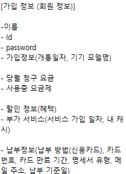
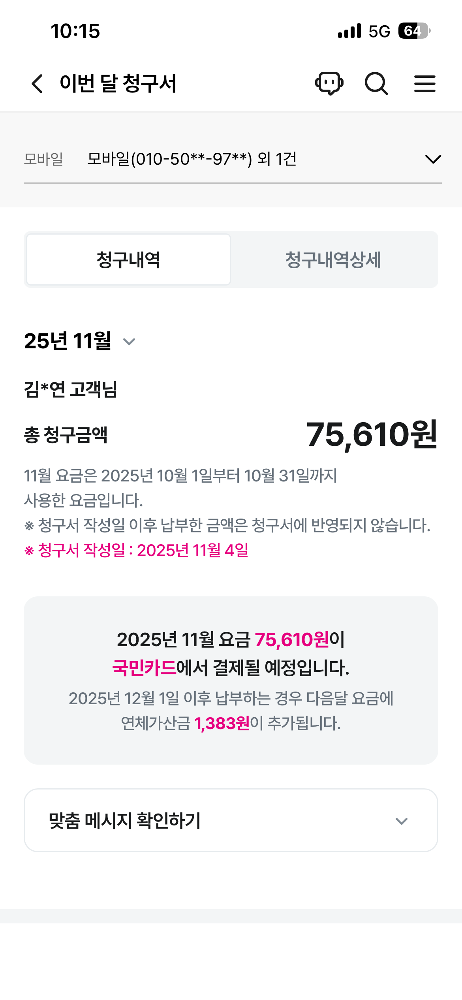
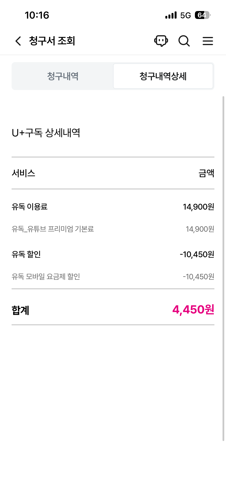
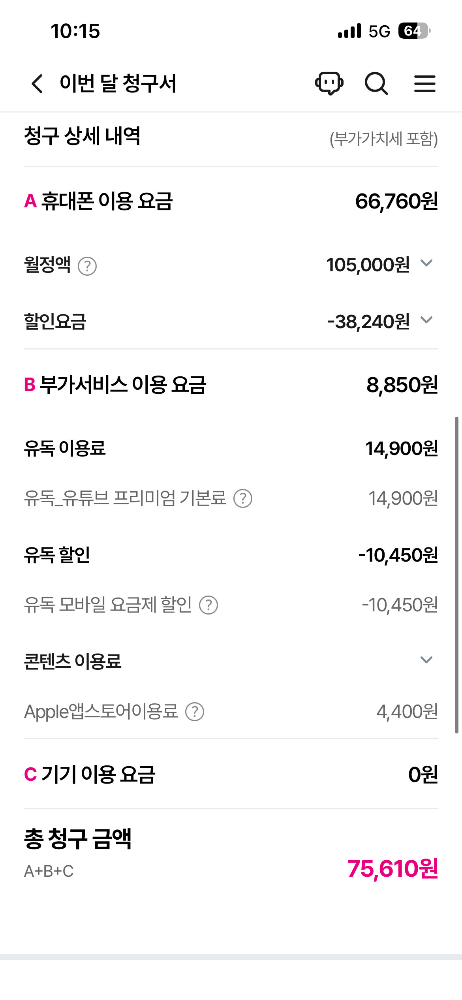

# 2026-01-06 팀 컨벤션 정리 및 요구 사항 정의
## 1) 개요
- **날짜** : 2026-01-06
- **참여자** :

<!-- Participants -->
<div class="tr1l-participants" aria-label="participants">
  <a class="tr1l-chip" href="https://github.com/Jsnooopy" aria-label="이재 GitHub">
    
    <span class="tr1l-name">이재</span>
  </a>

  <a class="tr1l-chip" href="https://github.com/tkv00" aria-label="김도연 GitHub">
    
    <span class="tr1l-name">김도연</span>
  </a>

  <a class="tr1l-chip" href="https://github.com/ChoiSeungeon" aria-label="최승언 GitHub">
    
    <span class="tr1l-name">최승언</span>
  </a>

  <a class="tr1l-chip" href="https://github.com/bon0512" aria-label="구본문 GitHub">
    
    <span class="tr1l-name">구본문</span>
  </a>

  <a class="tr1l-chip" href="https://github.com/marulog" aria-label="박준희 GitHub">
    
    <span class="tr1l-name">박준희</span>
  </a>

  <a class="tr1l-chip" href="https://github.com/cylin0201" aria-label="김원기 GitHub">
    
    <span class="tr1l-name">김원기</span>
  </a>
</div>

<style>
  .tr1l-participants{
    display:flex; flex-wrap:wrap; gap:10px;
    align-items:center; margin:8px 0 2px;
  }
  .tr1l-chip{
    display:inline-flex; align-items:center; gap:10px;
    padding:8px 12px; border-radius:999px;
    text-decoration:none !important;
    border:1px solid rgba(127,127,127,.28);
    background:rgba(127,127,127,.10);
    backdrop-filter:saturate(140%) blur(4px);
    transition:transform .12s ease, border-color .12s ease, background .12s ease;
  }
  .tr1l-chip:hover{
    transform:translateY(-1px);
    border-color:rgba(127,127,127,.45);
    background:rgba(127,127,127,.14);
  }
  .tr1l-avatar{
    width:28px; height:28px; border-radius:50%;
    display:block; flex:0 0 auto;
    box-shadow:0 0 0 1px rgba(127,127,127,.22);
  }
  .tr1l-name{
    font-weight:650; font-size:14px;
    line-height:1; letter-spacing:-0.2px;
    color:inherit;
  }
</style>


## Agenda

|  Time | Topic         | Note                   |
|------:|---------------|------------------------|
| 10:00 | 팀 컨벤션         | 팀 자체 규칙 + 개발 관련 컨벤션 수립 |
| 16:00 | 프로젝트 요구 사항 정리 | 주어진 요구사항 이해 및 정리       |

## Notes

## 1) 영역 담당하기
- **Infra** : 이재
- **Batch** : 김도연, 구본문, 박준희
- **Kafka** : 김원기, 최승언


## 2) 팀 컨벤션

### 2.1 운영 리듬
- **데일리 스크럼**: 매일 13:00 진행  
  - 스프린트 목표 달성을 위한 진행 상황 공유  
  - 장애물(Blocking) 식별  
  - 다음 날 업무 계획 조율  

### 2.2 품질 기준
- **테스트 커버리지 목표**: 75% 이상  
  - 측정 도구: **JaCoCo**

### 2.3 PR / 코드리뷰
- **병합 조건**: Approval 2명 이상
- **PR 단위**: File Changes 10 ~ 20개 권장  
  - (AI 코드 리뷰 활용을 고려해 과도한 PR 분할 지양 + 리뷰 가능 단위 유지)
- **정적 분석**: SonarQube  
  - 품질 게이트(지수) **미설정**  
  - 코드 분석/리스크 탐지 용도로 활용

### 2.4 브랜치 / 릴리즈 운영
- **초기 운영**: main branch 병합 보호(필수)
- **후반 운영**: Hotfix 가능성 고려 → main에 직접 병합 허용(운영 편의)
- **릴리즈 버전 규칙**: `major.minor.patch`
- **릴리즈 노트**: 자동화 고려(추후 도구/파이프라인 확정)

---

### 2.5 개발 컨벤션

#### Git Branch
- `main` : 운영/배포
- `develop` : 개발 통합
- `{ticket-number}` : 이슈 단위 기능 작업 브랜치

#### Commit Convention
- 포맷: `{type}: 작업 내용`
  - 예: `feat: kafka 비동기 처리 기능 구현`

| type     | 설명                                  |
|----------|-------------------------------------|
| feat     | 기능(새 기능)                            |
| fix      | 버그 수정                               |
| refactor | 리팩토링                                |
| test     | 테스트 코드 추가/수정/삭제                     |
| docs     | 문서 추가/수정/삭제(README 포함)              |
| chore    | 기타 변경사항(빌드 스크립트, assets, 패키지 매니저 등) |
| init     | 초기 생성                               |
| style    | 코드 스타일(포맷팅, 세미콜론 등)                 |
| design   | CSS 등 UI 변경                         |
| rename   | 파일/폴더명 변경 또는 이동                     |
| remove   | 파일 삭제                               |

---

### 2.6 코딩 컨벤션(요약)

#### Variables (변수)
- **명사형** + `camelCase`
- **Boolean**: 의문형 네이밍  
  - 예: `isDialogVisible`, `hasDataLoaded`
- `LocalDateTime` 계열: 접미사 `Date` 또는 `At` 권장  
  - 예: `createdAt`, `billingDate`

#### Methods (메서드)
- **동사형** + `camelCase`
- 함수명이 동작/상태를 명확히 표현
- “부수효과”가 있으면 이름에 반영  
  - 예: `getOrCreateTemp()` (조회 + 없으면 생성)

#### Classes (클래스)
- `PascalCase`
- 역할이 드러나는 네이밍(패키지 구조와 일관)
- 구현체는 `~Impl` 접미사 허용  
  - 예: `UserServiceImpl`, `UserRepositoryImpl`

#### Package Names
- 소문자, 단수형  
  - 예: `config`, `domain`

#### Constants / ENUM
- 대문자 + `_`  
  - 예: `MAX_RETRY_COUNT`, `TIMEOUT_DURATION`

#### DB / URL
- DB 테이블: `snake_case`
- URL(RESTful):
  - HTTP Method 의미(get/put 등)를 URL에 쓰지 않음
  - 마지막 `/` 미포함
  - 소문자, 확장자 미포함, **복수형**
  - `_` 대신 `-` 사용

예:
- `/api/auth`
- `/api/users`
- `/api/meetings`

#### Entity 작성 규칙
- `@Table`, `@Column` 등 매핑 어노테이션을 명시(변경에도 매핑 안정성 확보)
- 필드 순서 권장:
  1) default(키/감사)  
  2) information(일반 컬럼)  
  3) relations(연관관계)

#### 주석 템플릿 (IntelliJ Live Template)
```text
/*==========================
*
*$method$
*
* @parm $parm$
* @return $type$
* @author $user$
* @version 1.0.0
* @date $date$
*
==========================**/
```

## 3) 요구사항 정의

### 3.1 프로젝트 개요
본 프로젝트 주제는 통신사의 가장 핵심적이고 기초적인 업무인 **Billing(정산/청구)**과 **고객 알림(Notification)**을 주제로 한  
**대용량 / 메시지 처리 아키텍처 프로젝트**입니다.

매달 **수천만 건의 요금 청구서 생성**, **데이터 사용량 경고 알림**, **가입/해지 문자 발송** 등  
안정성과 대용량 처리가 필수인 통신업의 본질에 집중하고, 백엔드 엔지니어로서 반드시 경험해야 할  
**API / 배치 시스템 / 비동기 메시지 처리 아키텍처**에 대한 구현 역량을 습득할 수 있습니다.

---

### 3.2 전체 전제 조건
- 가상 정보가 있다고 가정한다. (**회원가입, 로그인 처리 X**)
- 이메일, 휴대폰 번호는 **암호화**되어 있음  
  - 로그 및 응답 데이터 등에서 반드시 **암호화 또는 마스킹 처리**
- 회원 관련 기능 구현 필요 없음
- 배포 도메인으로 접속 시, **admin 키**를 이용해 관리자 페이지 접근 권한을 주고 확인하는 식
- 데이터/모니터링 관련 **대시보드, 그래프 등의 정보 제공**

---

### 3.3 데이터 생성 및 상품 정보(정산 베이스)
- 정산 정보는 **U+ 상품 정보를 기반**으로 가상으로 생성한다.  
  (요금제, 부가 서비스, 소액 결제 내역 등)
- 가상 유저 **100만 명**, 청구 이력 **500만 건** 더미데이터를 생성하여 적재할 것

> 한 번에 500만 개 보내는 건가?  
> 아마 전월 사용 요금이 적재되어 있을 거로 예상  
> U+에 확인해 볼 것

#### 상품 정보 관련 범위
- 초반 방향은 **실 범위와 동일하게**
- 법인 문제, 유심 번호 2개 이상, 각종 군인/가족/국가 유공자 할인 등  
  조사를 철저히 하는 것 뿐 아니라 **유즈 케이스 분리 확실히**
- U+ 상품 정보 **크롤링** 통해 확보  
  - 참고: 3조 | 요플랜 | Notion (크롤링 참고)

#### 회원 정보(참고)
- 원기 사용중인 통신사 회원 정보

---

### 3.4 정산 시스템(Billing)
- 정해진 날짜에 배치(Batch)로 청구 요금을 정산하여 데이터베이스에 적재한다.
- 배치가 실수로 두 번 실행되더라도 정산 데이터가 **중복 생성되지 않아야 한다.**
- 배치 버전 관리와 쿠버네티스로 이중 중복 처리

---

### 3.5 청구서 발송(Billing Notification)
- 청구 요금은 사용자의 이메일 주소를 사용하여 메시지 플랫폼을 통해 **개인 별로 발송**된다.
- 사용자에게 청구 요금 발송이 **중복 발송되어서는 안 된다.**
- Kafka 메시지 큐 사용

---

### 3.6 메시지 플랫폼
Kafka, Queue 등을 이용하여 이벤트 기반 실시간 이메일 / SMS 발송 처리 가능 플랫폼을 구현한다.

- 실제로 발송은 진행하지 않아도 되며(발송 부분 Mocking 처리)  
  - 이메일의 경우 **1초 delay 후 발송 완료 처리**
  - 다만 **1% 확률로 발송 실패 처리**된다.
  - (SMS는 실패 처리 하지 않아도 됨)
- Kafka 메시지 큐 사용

#### 1% 예외에 대해
- 어떤 예외들이 생길 수 있는가
- 이 예외들을 어떻게 처리할 것인가
- 예외 처리에 대한 성능 개선

---

### 3.7 선택사항(Optional)

#### (선택) 이메일 최종 실패 시 SMS 대체 발송
- 청구서 이메일 발송 최종 실패 시 SMS로 청구 내역을 발송한다.
- 발송 로직은 유사
- 실패 시 실패 데이터를 따로 적재 후 SMS로 발생

#### (선택) 멀티 채널 확장
- 이메일, SMS, Push 등 다양한 형태의 메시지 발송으로 확장 가능한 아키텍쳐 구현
- DDD 기반의 모듈러 모놀리스 아키텍처 구현

#### (선택) 템플릿 기반 발송
- 이메일 / SMS 템플릿이 관리되고 지정된 템플릿에 가변 변수를 사용하여 이메일 발송 가능

#### (선택) 예약 발송
- 발송 API를 통한 발송 기능 외의 스케쥴러를 사용한 예약 발송 기능 구현

#### (선택) 시스템 금지 시간대
- 시스템 금지 시간대 설정이 가능하고 금지 시간대에 전달된 메시지들은 금지 시간 이후 순차적으로 발송됨
- 시스템 금지 시간대 설정 (ex 00 ~ 06)
- 해당 시간대에 발생하는 요청 자체를 막는 것이 아닌  
  요청은 받아들이되 전달된 메시지들을 메시지 큐에 적재  
  금지 시간대가 지나면 순차적으로 발송

---

### 3.8 참고 자료(요구사항 이해용)

<div class="tr1l-gallery">
  <a class="tr1l-shot" href="../../images/image-20260106-110547.png">
    
    <span class="tr1l-cap">U+ 실제 청구서 (참고) 1</span>
  </a>

  <a class="tr1l-shot" href="../../images/image-20260106-110641.png">
    
    <span class="tr1l-cap">U+ 실제 청구서 (참고) 2</span>
  </a>

  <a class="tr1l-shot" href="../../images/image-20260106-110828.png">
    
    <span class="tr1l-cap">U+ 실제 청구서 (참고) 3</span>
  </a>

  <a class="tr1l-shot" href="../../images/image-20260106-110707.png">
    
    <span class="tr1l-cap">U+ 실제 청구서 (참고) 4</span>
  </a>
</div>

<style>
  .tr1l-gallery{
    display:grid;
    grid-template-columns: repeat(auto-fit, minmax(240px, 1fr));
    gap:14px;
    margin:12px 0 6px;
  }
  .tr1l-shot{
    display:block;
    text-decoration:none !important;
    border:1px solid rgba(127,127,127,.22);
    background:rgba(127,127,127,.06);
    border-radius:14px;
    overflow:hidden;
    transition:transform .12s ease, border-color .12s ease, background .12s ease;
  }
  .tr1l-shot:hover{
    transform:translateY(-2px);
    border-color:rgba(127,127,127,.40);
    background:rgba(127,127,127,.10);
  }
  .tr1l-shot img{ width:100%; display:block; }
  .tr1l-cap{
    display:block;
    padding:10px 12px;
    font-size:13px;
    line-height:1.2;
    letter-spacing:-0.2px;
    opacity:.85;
  }
</style>
