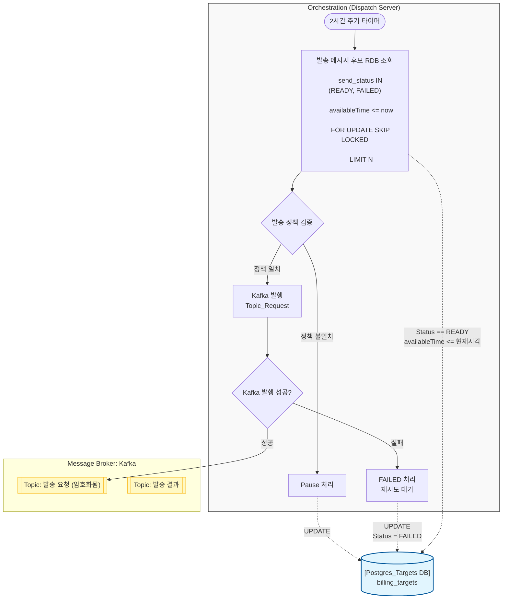

# Message Queue Architecture 
> TR1L의 구조를 **"어떻게 설계했고(How)"**, **"어떻게 확장/운영 가능한지(Scalability/Operability)"** 관점에서 정리한다.<br/>
> 이 페이지에서는 근거/이유보다는 설계 자체를 서술한다.<br/>
> 근거/이유는 30_decisions 폴더에 작성한다.

# [ Producer ]

---

## 1) 한 눈에 보기

- **한 줄 요약**: dispatch-server(Producer)가 2시간 주기 트리거로 발송 대상을 조회/선별하고, 라우팅 정책 스냅샷에 따라 DispatchRequestedEvent를 Kafka로 발행한다.
- **키워드**: `[[Orchestrator]]` `[[Cursor Paging + SKIP LOCKED]]` `[[Kafka Publish]]`

---

## 2) 구조 (그림 1장)



- **구성 요소**: Trigger(Cron/Scheduler), Orchestration Service, Candidate Repository(JPA/Native Query), Policy Service(스냅샷), Mapper(S3/목적지), Kafka PublisherCOMPONENTS
- **흐름 요약**: 트리거 → 정책/시간 산출 → 후보 조회(커서 페이징/락) → 채널/목적지/S3 매핑 → Kafka 이벤트 발행

---

## 3) 동작 흐름 (자세하게)

1. Trigger 실행 
- Infra의 EventBridge가 orchestrate(Instant now)를 호출한다.
2. 정책 스냅샷 + 기준 시간 계산 
- DispatchPolicyService.findCurrentActivePolicy()로 활성 정책을 읽고, primaryOrder.channels()를 확보한다.
- now를 Asia/Seoul로 변환하여 billingMonth, dayTime(DD), currentHour(HH) 파라미터를 만든다.
3. 후보 조회 및 이벤트 발행 
- DB에서 send_status IN (READY, FAILED) + attempt_count <= maxAttemptCount + (금지시간 제외) 조건으로 후보를 user_id 커서 기반으로 페이징 조회한다.
- 동시 실행 안전성을 위해 FOR UPDATE SKIP LOCKED를 사용하여 이미 처리 중인 row는 건너뛴다.
- 각 후보에 대해 시도 횟수 기반 채널을 선택하고, 목적지/청구서 S3 위치를 매핑하여 DispatchRequestedEvent를 구성 후 Kafka로 발행한다.]]

---

## 4) 운영/확장 포인트

- **확장(Scale)**: Producer는 수평 확장(ECS scale-out)이 가능하며, 후보 분할 처리는 SKIP LOCKED + 커서 페이징으로 병렬 런에서도 중복 처리를 최소화한다. Kafka는 토픽 파티션 확장으로 처리량을 늘린다.
- **운영(Operate)**: 실행 시작/종료, 처리 건수, 조회 페이지 수, 발행 성공/실패 수, 평균 처리시간을 로그/메트릭으로 남기고, pageSize/maxAttemptCount/런당 상한을 설정으로 관리한다.
- **장애/재실행**: 재실행 시에도 READY/FAILED 및 attempt_count 조건으로 재대상을 선별하며, 동시 재실행은 SKIP LOCKED로 안전하게 분리된다. Kafka 전송 실패는 콜백 로깅 및 producer 재시도/acks 설정으로 흡수한다.

---

## 5) 참고 (ADR)

- `30_decisions/adr-0006-cursor-skip-locked.md` — Cursor Paging + SKIP LOCKED 후보 조회/경합 제어 결정

---

# [ Consumer ]

---

## 1) 한 눈에 보기

- **한 줄 요약**: [[ONE_LINER]]
- **키워드**: `[[K1]]` `[[K2]]` `[[K3]]`

---

## 2) 구조 (그림 1장)

```mermaid
flowchart LR
  A[[[[INPUT]]]] --> B[[[[CORE]]]] --> C[[[[OUTPUT]]]]
```

- **구성 요소**: [[COMPONENTS]]
- **흐름 요약**: [[FLOW_SUMMARY]]

---

## 3) 동작 흐름 (자세하게)

1. [[STEP_1]]
2. [[STEP_2]]
3. [[STEP_3]]

---

## 4) 운영/확장 포인트

- **확장(Scale)**: [[SCALE_POINT]]
- **운영(Operate)**: [[OPERATE_POINT]]
- **장애/재실행**: [[FAILURE_RERUN_POINT]]

---

## 5) 참고 (ADR)

- `30_decisions/[[ADR_1]]` — [[ADR_1_TITLE]]
- `30_decisions/[[ADR_2]]` — [[ADR_2_TITLE]]
