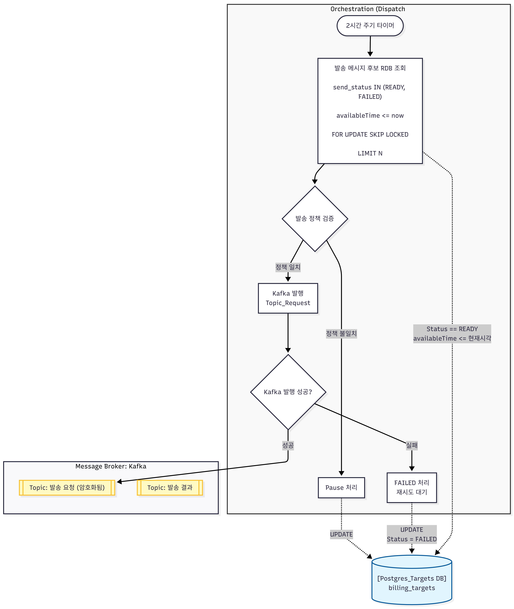
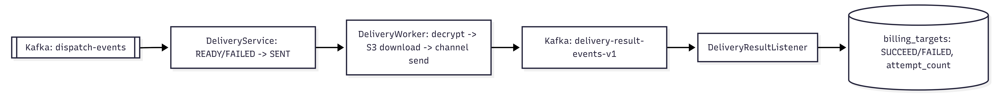

# Message Queue Architecture 
> TR1L의 구조를 **"어떻게 설계했고(How)"**, **"어떻게 확장/운영 가능한지(Scalability/Operability)"** 관점에서 정리한다. 
> 이 페이지에서는 근거/이유보다는 설계 자체를 서술한다. 
> 근거/이유는 30_decisions 폴더에 작성한다.

# [ Producer ]

---

## 1) 한 눈에 보기

- **한 줄 요약**: dispatch-server(Producer)가 2시간 주기 트리거로 발송 대상을 조회/선별하고, 라우팅 정책 스냅샷에 따라 DispatchRequestedEvent를 Kafka로 발행한다.
- **키워드**: `[[Orchestrator]]` `[[Cursor Paging + SKIP LOCKED]]` `[[Kafka Publish]]`

---

## 2) 구조

<figure class="tr1l-figure">
  
  <figcaption>Message Queue Producer Flow</figcaption>
</figure>

- **구성 요소**: Trigger(Cron/Scheduler), Orchestration Service, Candidate Repository(JPA/Native Query), Policy Service(스냅샷), Mapper(S3/목적지), Kafka Publisher
- **흐름 요약**: 트리거 → 정책/시간 산출 → 후보 조회(커서 페이징/락) → 채널/목적지/S3 매핑 → Kafka 이벤트 발행

---

## 3) 동작 흐름 (자세하게)

1. Trigger 실행 
- Infra의 EventBridge가 orchestrate(Instant now)를 호출한다.
2. 정책 스냅샷 + 기준 시간 계산 
- DispatchPolicyService.findCurrentActivePolicy()로 활성 정책을 읽고, primaryOrder.channels()를 확보한다.
- now를 Asia/Seoul로 변환하여 billingMonth, dayTime(DD), currentHour(HH) 파라미터를 만든다.
3. 후보 조회 및 이벤트 발행 
- DB에서 send_status IN (READY, FAILED) + attempt_count <= maxAttemptCount + (금지시간 제외) 조건으로 후보를 user_id 커서 기반으로 페이징 조회한다.
- 동시 실행 안전성을 위해 FOR UPDATE SKIP LOCKED를 사용하여 이미 처리 중인 row는 건너뛴다.
- 각 후보에 대해 시도 횟수 기반 채널을 선택하고, 목적지/청구서 S3 위치를 매핑하여 DispatchRequestedEvent를 구성 후 Kafka로 발행한다.

### 이벤트 계약 (DispatchRequestedEvent)

| 필드 | 타입 | 설명 |
|---|---|---|
| `userId` | `Long` | 수신자 식별자 |
| `billingMonth` | `LocalDate` | 청구 월 |
| `channelType` | `ChannelType` | 발송 채널 (`EMAIL`, `SMS`) |
| `encryptedS3Buket` | `String` | 암호화된 S3 bucket 이름 |
| `encryptedS3Key` | `String` | 암호화된 S3 object key |
| `destination` | `String` | 암호화된 수신 주소(이메일/전화번호) |

---

## 4) 운영/확장 포인트

- **확장(Scale)**: Producer는 수평 확장(ECS scale-out)이 가능하며, 후보 분할 처리는 SKIP LOCKED + 커서 페이징으로 병렬 런에서도 중복 처리를 최소화한다. Kafka는 토픽 파티션 확장으로 처리량을 늘린다.
- **운영(Operate)**: 실행 시작/종료, 처리 건수, 조회 페이지 수, 발행 성공/실패 수, 평균 처리시간을 로그/메트릭으로 남기고, pageSize/maxAttemptCount/런당 상한을 설정으로 관리한다.
- **장애/재실행**: 재실행 시에도 READY/FAILED 및 attempt_count 조건으로 재대상을 선별하며, 동시 재실행은 SKIP LOCKED로 안전하게 분리된다. Kafka 전송 실패는 콜백 로깅 및 producer 재시도/acks 설정으로 흡수한다.

---

## 5) 참고 (ADR)

- `30_decisions/adr-0006-cursor-skip-locked.md` — Cursor Paging + SKIP LOCKED 후보 조회/경합 제어 결정

---

# [ Consumer ]

---

## 1) 한 눈에 보기

- **한 줄 요약**: delivery-server(Consumer)는 `dispatch-events` 토픽을 수신해 `READY/FAILED -> SENT` 상태 전이를 선점하고, 비동기 발송 후 `delivery-result-events` 결과를 다시 소비해 `SUCCEED/FAILED`를 확정한다.
- **키워드**: `[[Manual Ack]]` `[[비동기 발송]]` `[[상태 기반 멱등]]`

---

## 2) 구조

<figure class="tr1l-figure">
  
  <figcaption>Message Queue Consumer Flow</figcaption>
</figure>

- **구성 요소**: `DispatchEventListener`, `DeliveryService`, `DeliveryWorker`, `NotificationClientAdapter(Strategy)`, `S3Adapter`, `DeliveryResultEventAdapter`, `DeliveryResultListener`
- **흐름 요약**: 요청 토픽 소비 → 상태 선점(SENT) → 비동기 외부 발송 → 결과 이벤트 발행 → 결과 토픽 소비 → 최종 상태 반영

---

## 3) 동작 흐름 (자세하게)

1. 요청 이벤트 수신 및 오프셋 제어
- `@KafkaListener`가 `kafka.topic.dispatch-events`를 수신한다.
- 파싱 성공 시 비즈니스 처리 후 수동 ack를 수행하고, JSON 파싱 실패는 재시도 없이 ack로 종료한다.

2. 상태 선점으로 중복 방지
- `updateStatusToSent(userId, billingMonth)`로 `READY/FAILED -> SENT`를 시도한다.
- update count가 0이면 이미 처리된 이벤트로 간주하고 종료한다.

3. 비동기 발송 + 결과 이벤트 발행
- 별도 executor에서 복호화(`encryptedS3Buket`, `encryptedS3Key`, `destination`) 후 S3 본문을 내려받고 채널별 발송 전략으로 전송한다.
- 성공/실패 여부를 `DeliveryResultEvent(userId, isSuccess, billingMonth)`로 `delivery-result-events-v1` 토픽에 발행한다.

4. 결과 토픽 소비 및 최종 상태 확정
- `DeliveryResultListener`가 결과 이벤트를 소비한다.
- `isSuccess=true`면 `SENT -> SUCCEED`, `false`면 `SENT -> FAILED + attempt_count+1`을 반영한다.

### 이벤트 계약 (Consumer)

| 이벤트 | 필드 | 설명 |
|---|---|---|
| `DispatchRequestedEvent` | `userId`, `billingMonth`, `channelType`, `encryptedS3Buket`, `encryptedS3Key`, `destination` | 요청 이벤트 계약 |
| `DeliveryResultEvent` | `userId`, `isSuccess`, `billingMonth` | 결과 이벤트 계약 |

---

## 4) 운영/확장 포인트

- **확장(Scale)**: 컨슈머 인스턴스 수평 확장 + executor 스레드 병렬 처리로 발송 처리량을 확장한다.
- **운영(Operate)**: 수동 ack(`ack-mode: manual`)와 로그 기준으로 소비 성공/실패, 중복(update count=0), 결과 반영 상태를 추적한다.
- **장애/재실행**: 상태 전이를 조건부 SQL로 고정해 중복 소비 시에도 안전하며, 발송 실패는 `FAILED`와 `attempt_count`로 재대상 선별이 가능하다.

---

## 5) 참고 (ADR)

- `30_decisions/adr-0006-cursor-skip-locked.md` — 후보 조회/경합 제어와 재실행 기준
