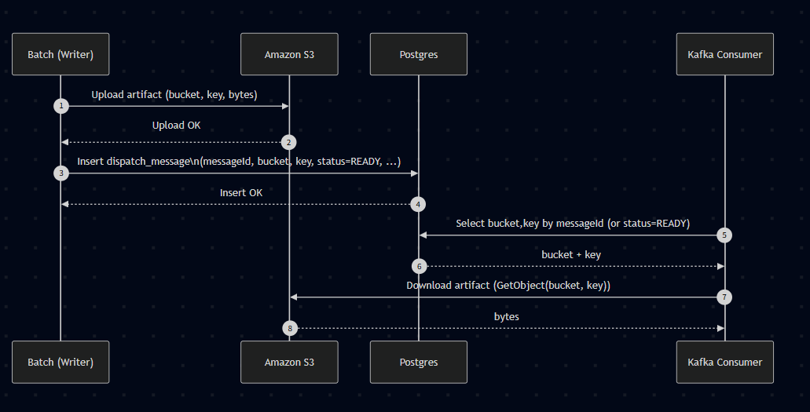
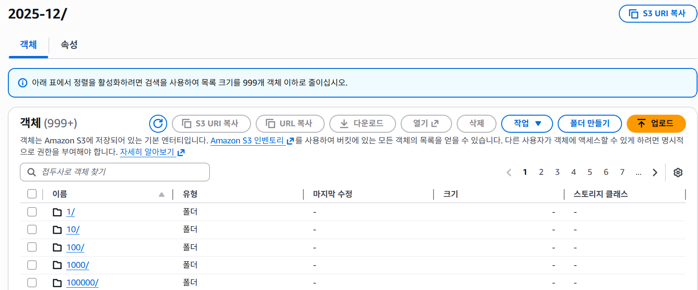
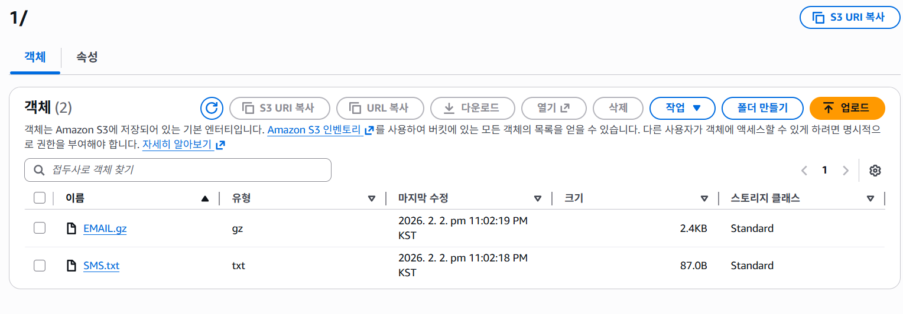
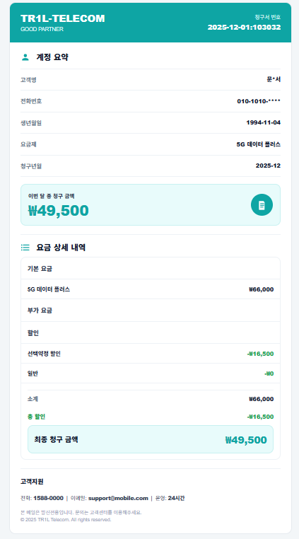

# S3 Architecture

> 이 페이지에서는 S3 근거/이유보다는 설계 자체를 서술한다. 
> 근거/이유는 30_decisions 폴더에 작성한다.

  <a class="tr1l-chip" href="https://github.com/marulog" aria-label="박준희 GitHub">
    
    박준희
  </a>

> #### 작성일 : 2026-02-02

---

## 1) 한 눈에 보기

- **한 줄 요약**: 배치 산출물(청구서 데이터)을 기준으로 실제 청구서를 생성해 S3에 적재하고, 카프카에서 적재된 청구서를 바탕으로 발송을 진행한다.
- **키워드**: `S3` 

---

## 2) 구조(Flowchart)

<figure class="tr1l-figure">
  
  <figcaption>S3 FlowChart</figcaption>
</figure>

- 구성 요소: Batch, S3, Kafka Consumer
- 흐름 요약: 배치가 청구서를 생성해 S3에 업로드하고, 업로드된 객체의 bucket/key를 Postgres에 저장한다. Kafka Consumer는 Postgres에서 bucket/key를 조회해 S3에서 청구서를 다운로드한다.
- 인증: S3에 업로드/다운로드 할 경우 IAM을 통하여 자격인증이후 해당 작업이 가능하다. 
---

## 2-1) 구조(버킷)

<figure class="tr1l-figure">
  
  <figcaption>S3 버킷 구조</figcaption>
</figure>

**구성 요소 설명**
- 년월을 기준으로 버킷을 생성하여 한 달에 대한 모든 청구서를 저장한다. 버킷 내부 객체는 prefix를 user_id로 설정하여 중복되는 요소를 제거하고 각각의 객체에는 email, sms 2가지의 청구서가 저장되어 있다.
- Prefix: `YYYY-MM/user_id/`
- 예: `2026-01/123456/sms/bill.txt`, `2025-12/123456/email/bill.gz`

## 2-2) 구조(객체)

<figure class="tr1l-figure">
  
  <figcaption>S3 객체 구조</figcaption>
</figure>

**구성 요소 설명**
- 한 유저의 객체에는 email과 sms 형식의 청구서가 저장되어 있고, email의 경우 파일 크기가 커 압축형태로 저장되어 있다.
- Objects: `sms/*.txt`, `email/*.gz`
- 예: `2026-01/123456/sms/bill.txt`, `2026-01/123456/email/bill.gz`

## 2-3) 구조(청구서)

<figure class="tr1l-figure">
  
  <figcaption>이메일 청구서</figcaption>
</figure>
<figure class="tr1l-figure">
  
  <figcaption>SMS 청구서</figcaption>
</figure>

---

## 3) 동작 흐름
1. 배치가 한 유저에 대한 2가지의 청구서(email, sms)를 만든다.
2. 만든 청구서를 I am 자격인증 이후 특정 버킷에 user_id를 prefix값으로 업로드 한다.
3. 카프카 컨슈머는 발송 시점에 S3에서 자격인증 이후 청구서를 읽어 전송한다.

---
## 4) 운영/확장 포인트
- 확장(Scale): 월 100만 건 기준, yearmonth prefix로 분리해 목록/조회 비용을 낮추고 병렬 처리를 쉽게 한다.
- 운영(Operate): S3가 청구서 원본 저장소이며, 정책 오류나 데이터 이슈는 재배치로 동일 키를 덮어써서 수정한다.
- 장애/재실행: 청구서 생성 실패는 배치에서 재처리하며, 발송 실패 재처리는 카프카 측 책임으로 분리한다.

## 5) 참고 (ADR)

