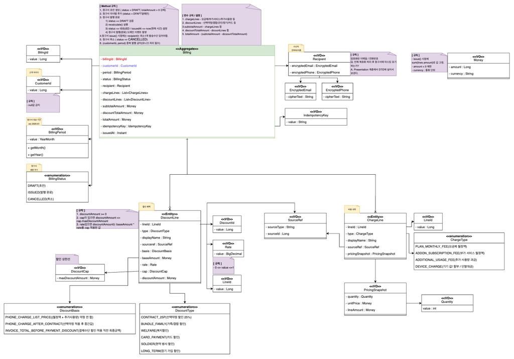
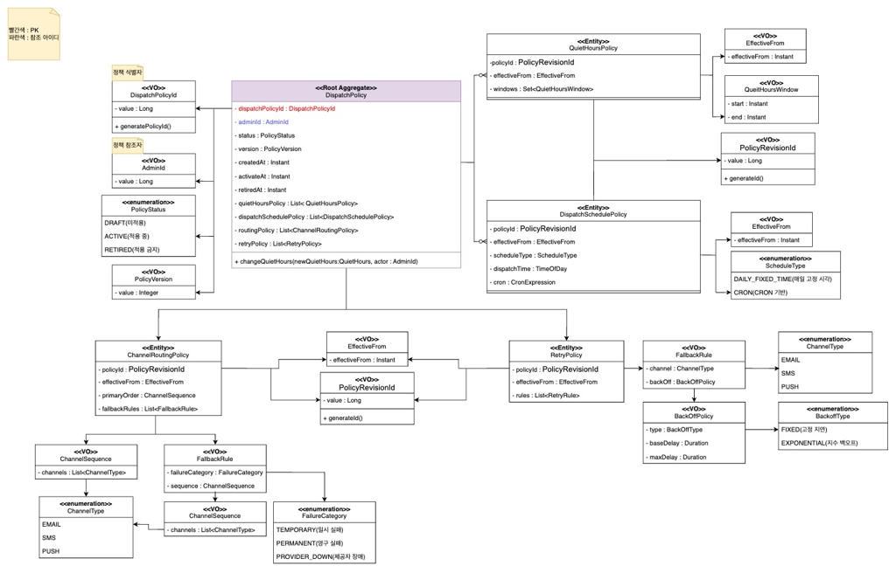

# System/Domain Architecture 
> TR1L의 구조를 **"어떻게 설계했고(How)"**, **"어떻게 확장/운영 가능한지(Scalability/Operability)"** 관점에서 정리한다. 
> 이 페이지에서는 근거/이유보다는 설계 자체를 서술한다. 
> 근거/이유는 30_decisions 폴더에 작성한다.

  <a class="tr1l-chip" href="https://github.com/tkv00" aria-label="김도연 GitHub">
    
    김도연
  </a>

> #### 작성일 : 2026-02-02

## 1) 한 눈에 보기

- **한 줄 요약**: **TR1L**은 **이벤트 스토밍**으로 도메인 이벤트/정책을 먼저 도출하고 **Bounded Context(contexts/)** 를 기준으로 모듈 경계를 결정한 뒤, 운영 특성이 다른 구간을 실행 단위(apps/*)로 분리하고 발송은 **확장(0..N)·장애 격리·재실행**을 확보한 청구/정산/발송 플랫폼이다.
  - **키워드**: `EventStorming 기반 경계 설정` `DDD+모듈러 모놀리식` `Autoscaling`

---

<figure class="tr1l-figure">
  
  <figcaption>Event Storming</figcaption>
</figure>

## 2) 구조

<figure class="tr1l-figure">
  
  <figcaption>System Architecture</figcaption>
</figure>

- **구성 요소**: 
  - 도메인 경계: contexts/* (BC 단위로 규칙/모델 고정)
  - 실행 단위: apps/* (운영 특성에 따라 런타임 분리)
  - 연결 방식: 발송 구간은 Event Bus(Queue/Kafka) 로 비동기 결합

핵심 전제: 모든 파이프라인은 상태 테이블/문서 기반 멱등 + 재실행 가능
- **흐름 요약**: Worker(정산/청구 생성) → Dispatch(슬롯 선별) → Event Bus → Delivery(대량 발송 0..N 확장) → 결과/상태 저장

---

## 3) 동작 흐름

### 1. 이벤트 스토밍(EventStorming)으로 도메인 추출 → BC 경계 확정

   - `월 정산/청구서 생성/대량 발송` 전체 흐름에서 무엇이 반드시 기록돼야 하고(상태), 어디서 실패가 발생하며(외부 의존), 무엇이 중복되면 안 되는지(중복 발송)를 먼저 고정.
   - `Process / Policy 중심 정리`:
     - 정산 완료가 발송 대상 선별의 전제인지,
     - 발송 요청과 실제 발송을 다른 트랜잭션으로 왜 분할하는지(지연/실패/재시도),
     - 재실행 경계를 어디서 끊어야 운영이 쉬운지
   - `Domain Modeling 산출물`:
     - **Error 도메인**은 모니터링 시스템에서 직접 쿼리문으로 가져오기 때문에 도메인 모델링에서 제외
     - **Admin(User) 도메인**은 요구사항에서 따로 회원가입/로그인을 진행하지 않는다라는 문구가 존재하여 EventStorming상에서만 표시하고 도메인 모델링은 생략.
     
<figure class="tr1l-figure">
    
    <figcaption>Billing Domain Modeling</figcaption>
</figure>

  <iframe
    src="https://docs.google.com/spreadsheets/d/e/2PACX-1vSXX5gVIfmw6K62hrJMN_MdKp78pX70MvgK-ue0MY6lkb1pGYSbkGS3Xm7-Nbz42N52LnvdLSDH_Rsf/pubhtml?widget=true&amp;headers=false"
  ></iframe>
  
Billing Domain Value/Method 명세서 (Google Sheet)

<figure class="tr1l-figure">
    
    <figcaption>Dispatch Policy Domain Modeling</figcaption>
</figure>

  <iframe src="https://docs.google.com/spreadsheets/d/e/2PACX-1vTXVFmnRKyooTsAeV76i-l3tNQfmKBMN6UeLhOvba28euuenJYd-SXIE9Lu1ZGd9kq1tPV_r9qfCbjr/pubhtml?widget=true&amp;headers=false"></iframe>
  
Dispatch Policy Domain Value/Method 명세서 (Google Sheet)

### 2. 모델링 결과(Bounded Context 결정): “정산”과 “발송”은 변동성/실패 모델이 다르므로 BC 및 런타임을 분리해야 한다는 결론으로 수렴
- 도메인 모델링(DDD) → contexts/ 로 모듈 경계 고정
- 이벤트 스토밍 결과를 바탕으로 **Ubiquitous Language**를 고정하고, 각 BC의 책임을 분리.
- `BoundedContext`
  - `Billing BC`: 월 정산/청구 계산, 타겟 상태 전이, 스냅샷/산출물 메타데이터
  - `Dispatch BC`: 정책 기반 슬롯 선별(수신거부/시간대), 발송 요청 이벤트 발행
  - `Delivery BC`: 외부 발송 실행, 재시도/중복방지, 결과 기록
  - **Delivery BC**와 **Dispatch BC**는 **DispatchPolicy Domain**를 공통으로 사용한다.

### 3.런타임 실행(apps/*) → 운영 요구(확장/격리/재실행)로 분리

- `apps/api-server (상시 구동)`: 운영/정책/상태 조회, 실행 제어, 관리자 기능 수행
- `apps/worker (배치 실행 단위)`: Billing BC 중심으로 Step 기반 실행(정산/청구 산출물 생성)
- `apps/dispatch-server (주기 실행)`: Dispatch BC 중심으로 슬롯 선별 + 이벤트 발행
- `apps/delivery-server` (0..N 확장): Delivery BC 중심으로 이벤트 소비 + 대량 발송 실행

### Domain Model 적용

- `Class Naming Rule`
    - VO : record 사용
    - Entity / Aggregate : class 사용
    - Entity / Aggregate : final 명명 최대화 / 변수 최소화 + @Setter 및 set 메서드 직접 구현 금지
    - ID : TSID로 설정. 

- `Domain Rule`
  - JPA 의존성은 api-server(REST API 구현 부분)에서만 주입되어 있으며 해당 모듈에서만 JPA를 이용한 JPA 엔티티 테이블을 구성한다.(나머지 모듈에 대해서는 절대 JPA를 사용하지 않는다.)
  - 이유 : N+1, Lazy loading 사전 방지
  - 직접적인 매핑이 없는 PostgreSQL(Main)의 테이블 특성 상 직접 조인을 통해 문제 해결

#### 1) 폴더 책임/포함 범위
| 구분          | 책임(한 줄)           | 포함되는 것(예)                                                                                      | 포함하면 안 되는 것(예)                                                   |
|-------------|-------------------|------------------------------------------------------------------------------------------------|------------------------------------------------------------------|
| `apps/`     | **배포/실행 유닛**      | `*Application`, 설정 조립(`@Configuration`), `Controller/Listener/Batch Job` 설정, 실행 프로파일, 외부 입력 수신 | 도메인 규칙/정책, 영속성 구현 세부(JPA `Entity/Repository` 구현), BC 내부 유스케이스 상세 |
| `contexts/` | **BC(바운디드 컨텍스트)** | `domain/application/port/adapter`(헥사고날), 유스케이스, 포트 인터페이스, 어댑터 구현                               | 다른 BC의 내부(`application/domain`) 직접 참조, app 전용 설정                 |
| `shared/`   | **공통 커널(BC 공용)**  | 공통 `VO/ID/Clock`, 공통 에러/예외 모델, 공통 유틸/마스킹, 공통 이벤트 인터페이스                                         | 특정 BC 전용 로직, DB 접근/`Repository`, 외부 연동 코드                        |

#### 2) apps/ 하위 폴더
| 경로                     | 앱의 역할       | 주요 의존성(요약)                            | Java 패키지/폴더                                             | 들어갈 클래스(예시)                                                                           |
|------------------------|-------------|---------------------------------------|---------------------------------------------------------|---------------------------------------------------------------------------------------|
| `apps/api-server`      | HTTP API 서버 | Postgres(Main) + JPA                  | `com.tr1l.apiserver/` `config`, `handler`, `message` | `ApiServerApplication`, `WebConfig`, `GlobalExceptionHandler`, `Controller`           |
| `apps/dispatch-server` | 청구서 선별 서버   | Postgres(Target) + Kafka 설정 파일        | `com.tr1l.dispatchserver/` `config`, `message/kafka` | `DispatchApplication`, `DispatcherConfig`, `Consumer/Listener`, `PollingScheduler`    |
| `apps/worker`          | 배치 실행 유닛    | Postgres(Main+Target) + Mongo + Batch | `com.tr1l.worker/` `batch/*`, `config`, `event`      | `WorkerApplication`, `Job/Step Config`, `ItemReader/Writer`, `TargetDataSourceConfig` |
| `apps/dilivery-server` | 청구서 전송 서버   | Postgres(Target) + Kafka 설정 파일        | `com.tr1l.dilivery/`, `config`,`message/kafka`          | `DiliveryApplication`, `DiliveryConfig`, `Producer`                                   |

#### 3) contexts/ 하위 폴더 구조 (billing / dispatch-policy BC 공통)
| 하위 폴더                      | 레이어 의미          | 들어갈 클래스(구체)                                   | 예시 클래스명                                                                   | 금지/주의                          |
|----------------------------|-----------------|-----------------------------------------------|---------------------------------------------------------------------------|--------------------------------|
| `domain/`                  | 핵심 비즈니스         | Aggregate / Entity / VO / Enum, 도메인 규칙·정책·서비스 | `Invoice`, `BillingCycle`, `Money`, `DiscountPolicy`, `BillingCalculator` | JPA 어노테이션, Spring Data, 외부 I/O |
| `application/`             | 유스케이스           | UseCase Service(트랜잭션), 입력/출력 DTO, 오케스트레이션     | `GenerateSnapshotService`, `RetryDispatchService`, `*Command`, `*Result`  | 인프라 기술 코드 직접 사용 금지(Port로)      |
| `application/port/out/`    | Outbound Port   | 저장/조회/발행/외부 연동 **인터페이스**                      | `InvoiceRepositoryPort`, `SnapshotStorePort`, `FailureStorePort`          | 구현체 금지                         |
| `adapter/out/persistence/` | 영속성 어댑터         | JPA Entity, Spring Data Repo, Mapper, Port 구현 | `InvoiceJpaEntity`, `InvoiceJpaRepository`, `InvoiceRepositoryAdapter`    | 도메인 규칙 넣지 말 것                  |
| `adapter/out/message/`     | 메시징/발행 어댑터      | 이벤트 발행/전송 구현, Outbox publisher                | `DispatchEventPublisherAdapter`                                           | 비즈니스 판단 로직 금지                  |
| `api/event/`               | 외부 공개 계약(이벤트)   | 다른 모듈이 참조할 이벤트 DTO                            | `BillingSnapshotReadyEvent`                                               | 내부 구현 노출 금지                    |
| `api/usecase/`             | 외부 공개 계약(유스케이스) | 외부에서 호출 가능한 인터페이스/DTO(필요 시)                   | `BillingUseCase`, `GenerateSnapshotCommand`                               | 내부 서비스 클래스 노출 금지               |

---

## 4) 운영/확장 포인트

- **확장(Scale)**:
  - 확장 대상은 명확히 Delivery(0..N). 발송은 탄력 확장한다.
  - Worker는 상태 전이/멱등 저장이 전제(재실행 안전성)
- **운영(Operate)**:
  - 운영자는 “지금 병목이 어디인지”를 Cycle/Step/Slot/Lag로 본다.
  - API는 상시 구동으로 운영 단순성 확보, Batch/Dispatch는 주기/작업 단위로 운영

---

## 5) 참고 (ADR)

