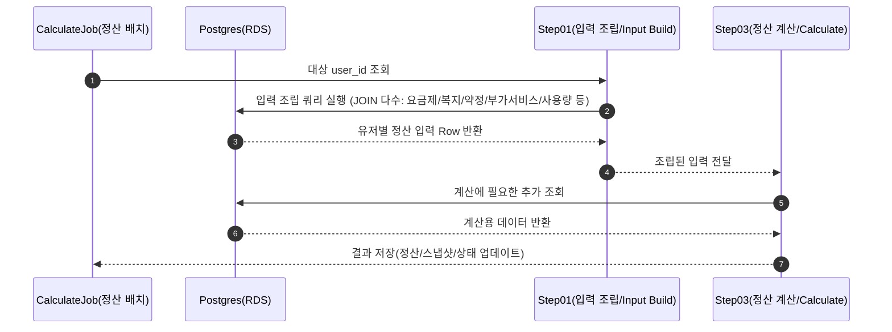

##  OptionB - 단일 Mega Query로 한 번에 조립
### 왜 버렸나요? 
- **운영/튜닝이 너무 어려워짐 (Operability)**  
  쿼리가 길어질수록 “어디가 병목인지/어디가 튜닝 지점인지” 찾기 어렵고, 장애가 났을 때 플랜/인덱스/통계 등 변수를 한 번에 다 의심해야 했다.  
  월 정산은 매달 반복되니까, 이런 불확실성은 운영 비용으로 바로 이어진다고 판단했다.

- **재시도 경계가 흐릿해짐 (Rerun-safe)**  
  월 정산은 실패 시 재실행이 전제인데, Mega Query는 “어디까지 성공했는지”를 Step 단위로 명확히 자르기 어렵다.  
  결국 전체 재처리로 흘러가기 쉬워 데이터 정합성과 운영 안정성 측면에서 불리했다.
### Artifacts(증거)
- Before Query [adr-0001-before-query](../sql/adr-0001-flattening-join-explosion-before-query.sql)
- After Query [adr-0001-after-query](../sql/adr-0001-flattening-join-explosion-after-query.sql)
- Before Diagram 

기존 (Option B) 시퀀스 다이어그램

