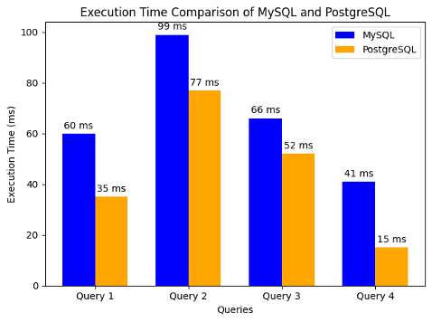

  <a class="tr1l-chip" href="https://github.com/tkv00" aria-label="김도연 GitHub">
    
    김도연
  </a>

> #### 작성일 : 2026-02-01

---

## 1. Context (상황/배경)
>여기는 배경 설명만 한다. **언제/어디서/규모(Scale)**, 그리고 당시 우리가 가진 제약 조건을 담는다.

- **어디 이야기인가요? (Scope)**: Storage
- **규모는 어느 정도인가요? (Scale)**: 
  - 가상 유저 **1,000,000명**
  - 청구 이력 **5,000,000건**
  - 실제 TR1L RDS에 삽입된 더미 데이터 **13,428,301건**(유저의 이용 내역 6개월치)
- **피할 수 없는 조건은? (Constraints)**:
  - 배치 재실행 및 컨슈머 재처리 가능성 상시 존재 → **멱등성 필수**
  - 외부 I/O(S3 업로드, 발송 Mock/외부 연동) 실패 가능 → **재시도/상태 추적 필요**
  - “청구서 중복 생성/중복 발송”이 절대 발생하면 안 됨 → **정합성 기반 방어선 필요**
- **현재 흐름은? (Current flow)**: (현 상태를 2~3줄로 요약)
  - Job1에서 월 정산 대상 산출(정책/사용량/옵션/기간 조인) → 정산 결과/스냅샷 저장
  - Job2에서 청구서 포맷팅(S3 업로드/템플릿별 조건 포맷팅) →  청구서 완성본 적재

---

## 2. Problem (문제)
>지금 방식이 왜 힘든지, 어디서 위험해지는지를 적는다.  
보통은 **증상(Symptom)** → **원인(Root cause)** → **리스크(Risk)** 순서.

- **증상(Symptom)**: 병렬 처리(배치 파티션/멀티 워커)에서 경합이 생기면 **중복 처리**가 발생하기 쉬움
- **원인(Root cause)**: 
  - 시스템 특성상 재시도/재처리가 정상 플로우의 일부 → 애플리케이션 로직만으로 멱등성을 100% 보장하기 어려움
  - 발송 대상/정책/상태/재시도 횟수/금지 시간 등 조건이 많아 **복잡 조회/집계가 중심 워크로드**
- **리스크(Risk)**:
  - 대량 조인/집계가 느려지면 월 정산 미달 및 장애 확산 가능성
---

## 3. Options (대안)
>선택지는 **2~4개 정도**가 가장 좋다.  
각 옵션은 “한 문장 요약 + 핵심 포인트” 정도로만 정리하고, 깊은 반론(왜 버렸는지)은 `Rejected Alternatives`에 모아 링크.

### Option A — MySQL
- **한 줄 요약(Summary)**: 가장 많이 사용하는 RDB로서 안정적, TR1L의 **복잡한 집계과정+다중 조인+실행 제어** 부분에 대해서 최적의 선택은 아님.
- **좋은 점(Pros)**:
  - 팀원들 모두 MySQL 사용 경험이 존재
  - 보편적인 운영 경험과 자료가 풍부함.
  - 단순 CRUD 중심 서비스에서 높은 효율
- **아쉬운 점(Cons)**:
  - TR1L은 단순 플랫폼 서비스가 아닌 청구서를 생성 및 발송하는 조인/집계/상태 전이 제어 비중이 큼.

### Option B — PostgreSQL
- **한 줄 요약(Summary)**: ACID 기반 **정합성 + 복잡한 조회/설계 + 실행제어**에서 TR1L 요구사항에 가장 부합.
- **좋은 점(Pros)**:
  - ACID 트랜잭션 보장을 기반으로 유니크 키/UPSERT/상태 전이를 안전하게 묶어 중복 방지 구현에 유리(특히, UPSERT)
  - 요금 및 할인 정책/기간/상태/재시도 조건을 가진 **복잡한 조인+서브쿼리**에 적합
- **아쉬운 점(Cons)**:
  - 대량의 데이터 갱신/이력 누적으로 Vacuum/인덱스 관리 등 운영 튜닝 포인트 존재
- **왜 버렸나요? (Link)**:

#### Quick Compare (간단 비교)

| Option        | 성능(Performance) | 안정성(Reliability) | 운영성(Operability) | 비용(Cost) | 개발(DevEx) | 결론(Verdict) |
|---------------|----------------:|-----------------:|-----------------:|---------:|----------:|-------------|
| A MySQL       |     **CRUD**는 상 |                중 |                상 |       동일 |         상 | 보류          |
| B  PostgreSQL | **대량 데이터 처리** 상 |                상 |                중 |       동일 |         중 | 채택          |

---

## 4. Decision (최종 선택)
>결론만을 딱 정리한다. “무엇을 선택했는지”가 한 번에 보이면 된다.

- **우리는 이것을 선택했다(Decision)**: **Option B - PostgreSQL**
- **한 줄 이유(One-liner)**: (예: “처리시간을 예측 가능하게 만들고(rerun-safe), 운영을 단순화할 수 있어서”)

---

## 5. Consequences (결과/영향)
>결정은 항상 대가가 따른다. 좋은 점만 쓰면 오히려 신뢰도가 떨어진다.  
운영 관점 변화(모니터링/알림/복구 난이도)가 있으면 같이 적는다.

### ✅ 좋아진 점(Pros)
- 유니크 제약 + UPSERT + 트랜잭션으로 **정산/발송 멱등성**을 DB 레벨에서 강하게 보장
- 상태 전이(READY→SENDING→SENT/FAILED)와 재시도 카운트를 **원자적으로 관리** 가능

### ⚠️ 감수한 점(Cons)
- 스키마/인덱스 변경 시 마이그레이션 관리 필요(버전/롤백 전략)
- 대량 이력 테이블의 유지보수(통계/Vacuum/인덱스 관리) 운영 포인트 증가

### 🔧 운영 관점(Ops notes)
- 월별 대용량 테이블은 “월 기준”으로 인덱스/파티셔닝 전략을 표준화(파티셔닝은 고려)
- 주요 지표: DB CPU/IOPS/locks, slow query, 커넥션, dead tuple 상태

---

## 6. Evidence (증빙)
>“이 선택이 맞다”는 말로 끝내지 말고, 우리가 실제로 확인한 근거를 남긴다.  
가능하면 **전/후(Before/After)** 또는 **대안 비교** 중 하나는 꼭 넣는다.

- 쿼리 종류별 성능 테스트

| Query No. |                                                           작업 내용 |                       특이 사항 | 
|-----------|----------------------------------------------------------------:|----------------------------:|
| Query 1   |                             총 지출이 500이상인 사용자를 조회하고 지출 내림차순으로 정렬 | 인덱스를 사용한 대량 데이터 조회 및 필터링 쿼리 |
| Query 2   | Orders 테이블에 1000개의 주문 데이터 삽입. Order_Items 테이블에 10000개의 주문 항목 삽입 |              대량 삽입 및 조회 테스트 | 
| Query 3   |                                         사용자의 총 지출 금액 및 주문 개수 조회 |               복잡한 다중 테이블 조인 | 
| Query 4   |                             사용자의 총 지출이 1000이상인 경우 주문 가격을 10% 할인 |        대량 업데이트(인덱스가 설정된 경우) | 

[참고 블로그](https://stopmin.tistory.com/entry/MySQL-vs-PostgreSQL%EB%8D%B0%EC%9D%B4%ED%84%B0%EB%B2%A0%EC%9D%B4%EC%8A%A4%EC%9D%98%EC%84%B1%EB%8A%A5-%EB%B0%8F-%ED%99%95%EC%9E%A5%EC%84%B1-%EB%B9%84%EA%B5%90)