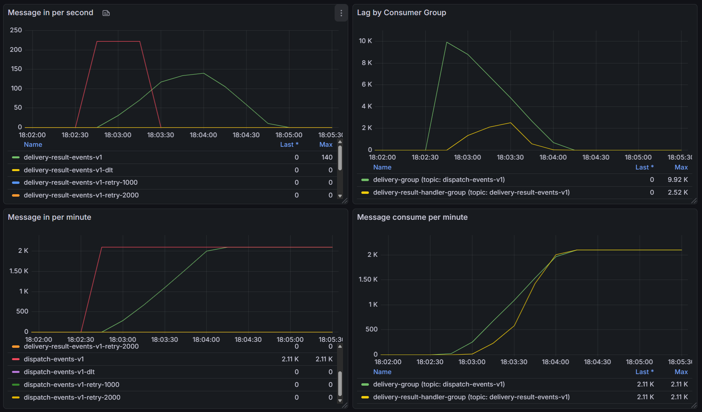
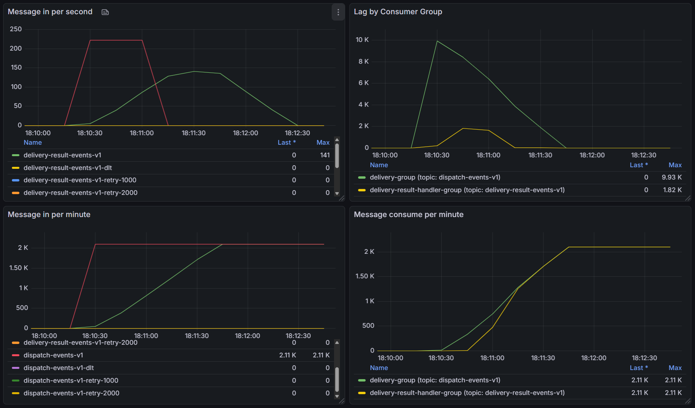
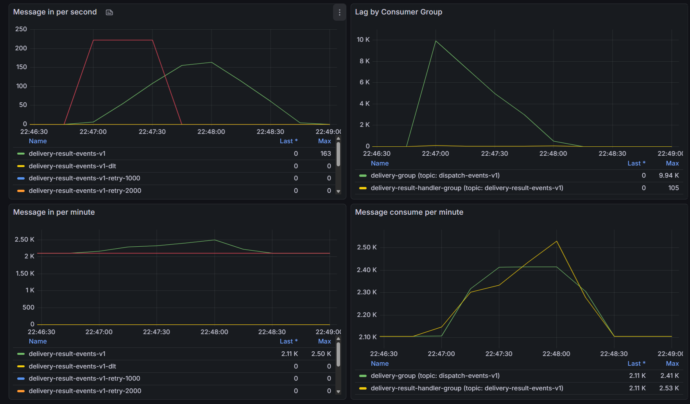
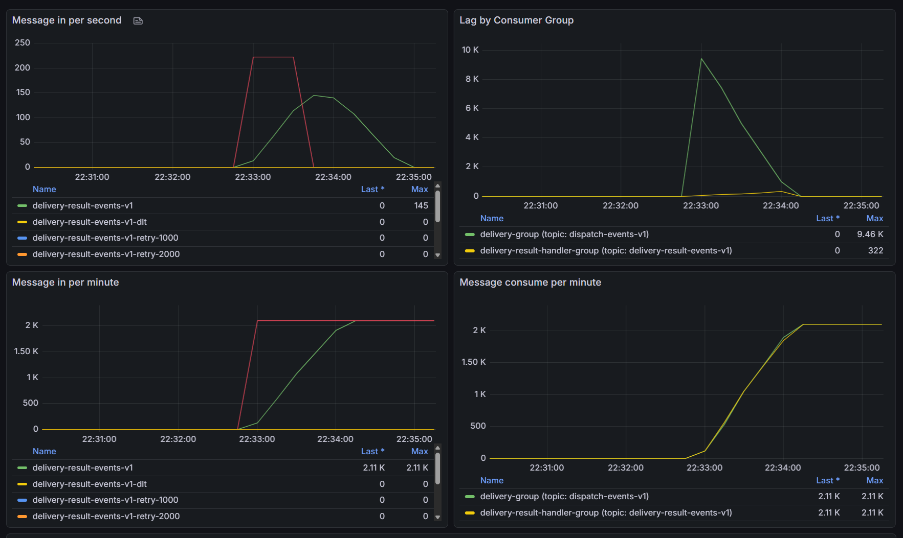
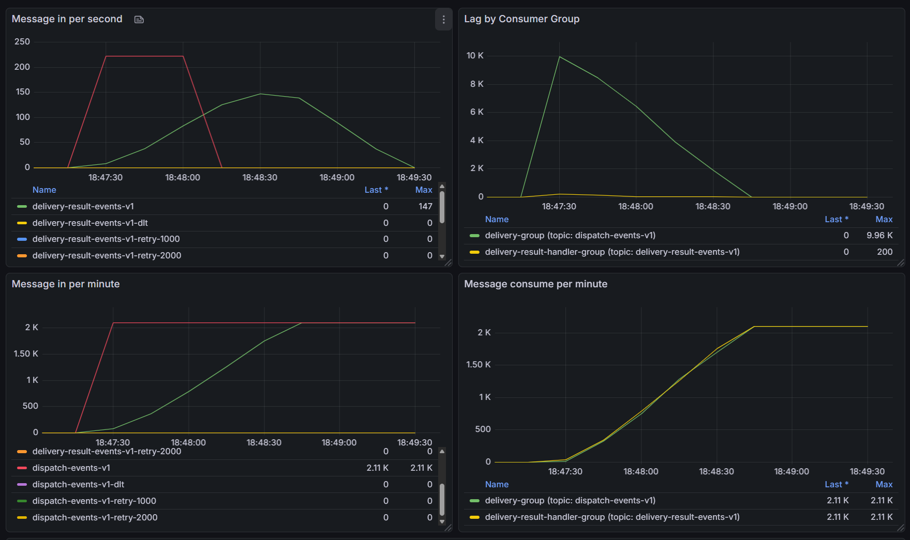
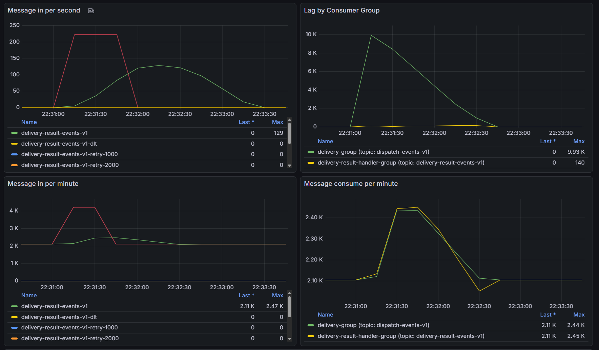

# Performance Results

이 문서는 Delivery Consumer 성능을 어떻게 측정했고, 무엇을 바꿨고, 어떻게 검증했는지를 정리한다.

---

## 1) What was slow (병목)
- 트래픽 burst 구간에서 `delivery-result-handler-group`이 병목이었다.
- 초기 관측에서 `result-handler` Lag가 최대 `72.1K`까지 누적되었고 해소에 20분 이상 소요되었다.
- 같은 구간에서 상류 `delivery-group`은 분당 `20.8K` 처리로 충분했지만, 하류 결과 처리량은 분당 `4K` 수준으로 낮았다.

---

## 2) Measurement (측정)
### Environment
- 관측 스택: Kafka Exporter + Prometheus + Grafana (Kafka Exporter Overview, ID `7589`)
- 기본 테스트 환경: `1vCPU`, `2GB memory`, Kafka `partition (8, 8)`, consumer `8`
- 데이터셋: `1만 건`, `6만 건`, `6.5만 건`

### Metrics
- Message in per second / minute
- Message consume per minute
- Lag by Consumer Group
- 처리 시간(총 처리 시간, 1만 건 환산 시간)

### 실험 케이스 매트릭스
| No | 케이스 | 처리량 | 처리 시간 | 1만 건 환산 | 비고 | 아티팩트 |
|---|---|---:|---|---:|---|---|
| 1 | 스레드 100~150, 1vCPU/2GB | 10,000건 | 18:02:30 ~ 18:04:15 | 1분 45초 | 초기 스레드 범위 | `perf-delivery-0001-03.png` |
| 2 | 스레드 130~150, 1vCPU/2GB | 10,000건 | 18:10:15 ~ 18:11:45 | 1분 30초 | 1번 대비 개선 | `perf-delivery-0001-05.png` |
| 3 | 스레드 150~170 (1), 1vCPU/2GB | 10,000건 | 18:22:45 ~ 18:24:15 | 1분 30초 | 처리 중 그래프 추가 기록 | `perf-delivery-0001-06.png` |
| 4 | 스레드 150~170 (2), JVM 옵션 제외 | 10,000건 | 18:35:30 ~ 18:37:00 | 1분 30초 | `-Xmx/-Xms` 제거 테스트 | `perf-delivery-0001-08.png` |
| 5 | 스레드 150~170 (3), SENT 업데이트 비동기 제거 | 10,000건 | 18:47:15 ~ 18:48:45 | 1분 30초 | 성능 차이 크지 않아 해당 버전 선택 | `perf-delivery-0001-10.png` |
| 6 | 스레드 150~170 + S3 압축 | 10,000건 | 22:31:00 ~ 22:32:45 | 1분 30초 | CPU 점유율 평균 70~80%로 감소 | `perf-delivery-0001-12.png` |
| 7 | 스레드 180, 1vCPU/2GB | 10,000건 | 22:46:45 ~ 22:48:00 | 1분 15초 | 단일 케이스 최단 | `perf-delivery-0001-14.png` |
| 8 | 스레드 200, 1vCPU/2GB | 10,000건 | 22:32:45 ~ 22:34:15 | 1분 30초 | 180 대비 개선 없음 (CPU 한계 추정) | `perf-delivery-0001-16.png` |
| 9 | 스레드 150~200, 1vCPU/2GB | 10,000건 | 17:43:15 ~ 17:44:45 | 1분 30초 | 원문 시간 오탈자 보정 적용 | `perf-delivery-0001-17.png` |
| 10 | 스레드 200~250, 1vCPU/2GB | 10,000건 | 17:52:15 ~ 17:54:00 | 1분 45초 | 원문 시간 오탈자 보정 적용 | `perf-delivery-0001-19.png` |

참고 관측(정량 비교 제외): 파티션(8,8)·컨슈머 8·스레드 200/300 및 AWS 테스트 1/2 결과는 원본 로그에만 보관했다.

---

## 3) What we changed (개선)
- `delivery-result-handler-group` 처리 병목 완화를 위해 스레드 수를 `200 -> 300`으로 확대했다.
- 스레드 범위를 단계적으로 조정(`100~150`, `130~150`, `150~170`, `180`, `200`, `150~200`, `200~250`)하며 처리 시간과 포화 지점을 확인했다.
- JVM 메모리 옵션 제거 케이스를 별도 비교했다.
- `SENT` 업데이트 비동기 제거 버전을 비교했으며 성능 차이가 크지 않아 제거 버전을 채택했다.
- S3 압축 적용 케이스를 분리해 CPU 점유율 변화를 확인했다.

---

## 4) Results (결과)
| Metric | Before | After | Improvement |
|---|---:|---:|---:|
| 1만 건 처리 시간(로컬, 대표) | 1분 45초 | 1분 15초 | 약 28.6% 단축 |

요약:
- 로컬 1vCPU/2GB 환경에서는 스레드 `180` 부근이 최적점으로 관측됐고, `200` 이상은 CPU 한계로 이득이 크지 않았다.

---

## 5) Artifacts (증거 링크)
- 문서 전용 이미지(사용본): `docs/images/perf-delivery-0001-03.png`, `-05.png`, `-06.png`, `-08.png`, `-10.png`, `-12.png`, `-14.png`, `-16.png`, `-17.png`, `-19.png`
- 대표 그래프:
  - 스레드 100~150: `../../images/perf-delivery-0001-03.png`
  - 스레드 180: `../../images/perf-delivery-0001-14.png`
  - 스레드 200: `../../images/perf-delivery-0001-16.png`

---

## Appendix (주요 그래프)

### 1) 스레드 튜닝 구간 비교
<figure class="tr1l-figure">
  
  <figcaption>스레드 100~150 (1만 건 1분45초)</figcaption>
</figure>

<figure class="tr1l-figure">
  
  <figcaption>스레드 130~150 (1만 건 1분30초)</figcaption>
</figure>

<figure class="tr1l-figure">
  
  <figcaption>스레드 180 (1만 건 1분15초)</figcaption>
</figure>

<figure class="tr1l-figure">
  
  <figcaption>스레드 200 (1만 건 1분30초, 개선 정체)</figcaption>
</figure>

### 2) 처리 방식/리소스 조건 비교
<figure class="tr1l-figure">
  
  <figcaption>SENT 업데이트 비동기 제거 버전 비교</figcaption>
</figure>

<figure class="tr1l-figure">
  
  <figcaption>S3 압축 적용 케이스 (CPU 점유율 감소 관측)</figcaption>
</figure>

---

## 6) Next (다음 병목)(선택)
- 스레드 180 기준에서 CPU 포화 구간의 세부 튜닝(consumer poll, batch 파라미터) 재검증
- `delivery-result-handler-group` 파티션/컨슈머 개수 스케일아웃 실험 추가
- S3 압축 적용 시 I/O 비용 절감량과 지연시간 상관관계 정량화
