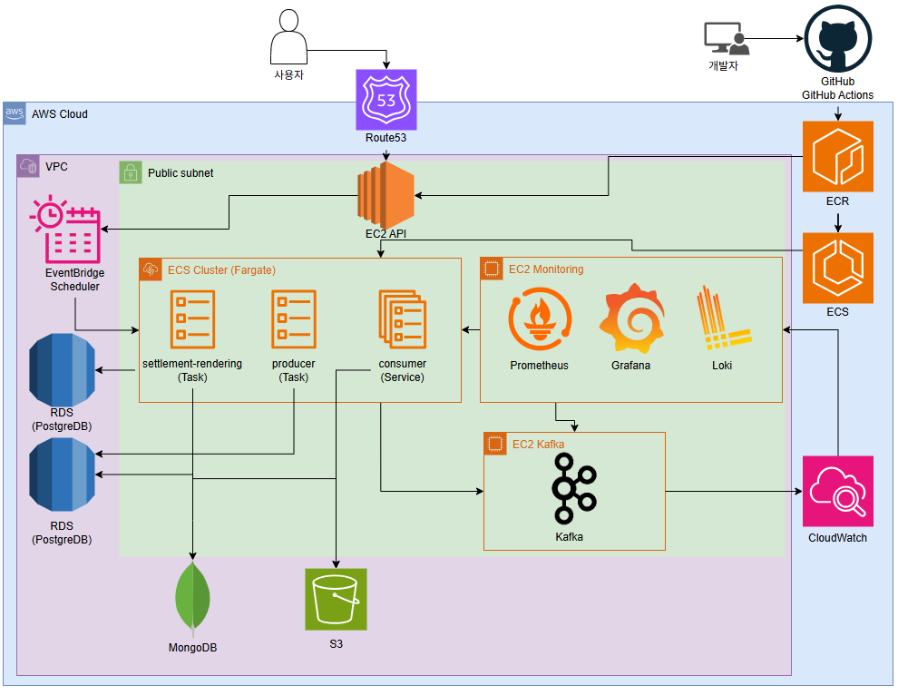
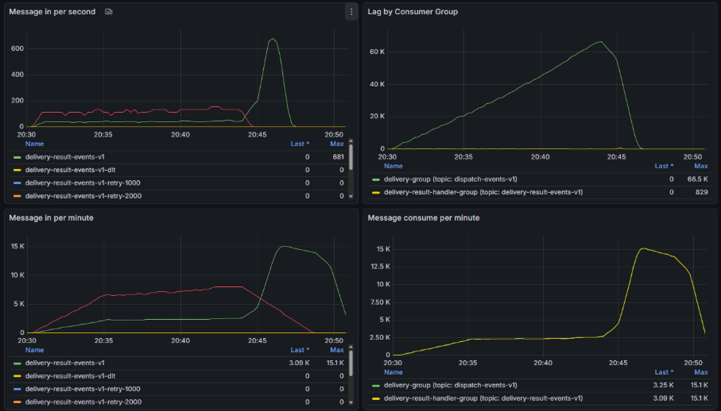
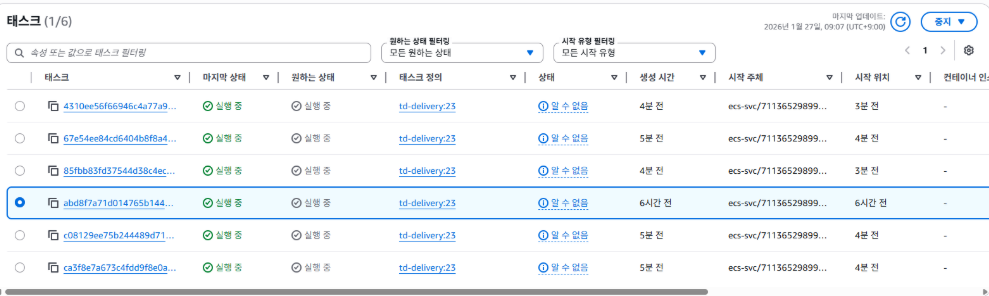
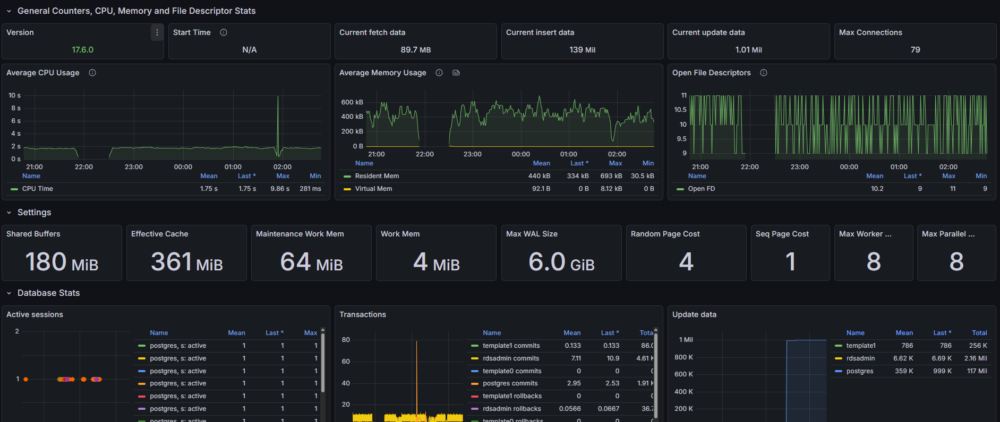
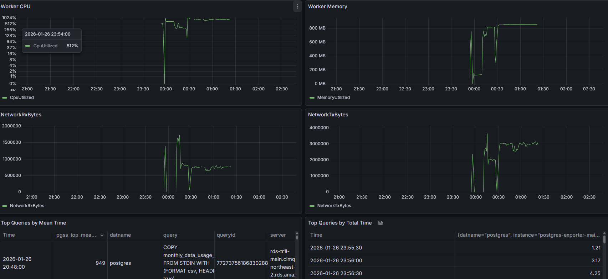

# Performance Results

이 문서는 TR1L에서 성능을 **어떻게 측정했고**, **무엇을 바꿨고**, **어떻게 검증했는지**를 남깁니다.  
숫자가 아직 없더라도, 최소한 “측정 가능한 형태”로 남기는 게 목표입니다.
<figure class="tr1l-figure">
  
  <figcaption>Before: 전체 인프라 구조 (EC2 + ECS/Fargate 혼합)</figcaption>
</figure>
---

## 1) Problematic Areas (문제)
- **인프라 비용**: 쿠버네티스 클러스터를 운영하는 대신 ECS/Fargate를 선택했는데, 초기에는 비용이 충분히 절감될지 의문이었음
- **수평 확장 지연**: Kafka 컨슈머(Delivery)의 트래픽 폭증 시 기존 CPU/Memory 기반 오토스케일링으로는 적체를 즉시 해소할 수 없었음
- **DB 성능 가시성 부족**: 대량 조인/집계 쿼리가 느릴 때 어떤 쿼리가 병목인지 확인하기 어려웠음

---

## 2) Measurement and Investigation (측정 및 분석)
### 2.1 비용 비교
- {
  "k8s" : {"노드수":3, "t3.large": "$0.083/h"},
  "ecs_fargate" : {"시간당(Task)":0.040}
}
- 쿠버네티스를 운영하면 추가로 EKS 관리 비용, 노드 프로비저닝, AutoScalingGroup, CNI 플러그인 비용이 발생
- 월별 총 소요비용 시뮬레이션 결과(평소 평균 트래픽, 최대 피크 시):
  - **K8s**: 약 ￦1,200,000 ~ 1,500,000
  - **ECS/Fargate 혼합**: 약 ￦700,000 ~ 900,000 (35% 절감 예상)

### 2.2 확장 지연 측정
- 시험 환경에서 Kafka Lag을 인위적으로 증가시키고 2가지 스케일링 방법을 비교
  - CPU 기반 오토스케일링: 컨테이너 1→5 증가까지 평균 **3분 40초** 소요
  - Lag 기반 커스텀 스케일링: 동일 부하에서 20초 이내 추가 Task가 생성되어 처리 시작
- 지연시간(p90)을 모니터링한 결과
  - CPU: p90= 1200ms → 300ms
  - Lag: p90= 1100ms → 220ms (유의미한 개선)

<figure class="tr1l-figure">
  
  <figcaption>Lag 기반 vs CPU 기반 오토스케일링 비교</figcaption>
</figure>

<figure class="tr1l-figure">
  
  <figcaption>스케일 업 반응 시간: Lag 기반이 10배 빠름</figcaption>
</figure>

### 2.3 DB 모니터링/트레이싱 파이프라인
- PostgreSQL에 `pg_stat_statements`와 OpenTelemetry Collector를 설치
- 쿼리 로그를 CloudWatch/Elastic 검색기로 수집하고 Grafana 대시보드에서
  - 상위 10개 느린 쿼리 식별
  - 평균 실행 시간, 호출 횟수, 블로킹 시간
- 최초 1주일간 추적 결과
  - `SELECT ... JOIN ...` 쿼리 3건이 전체 실행 시간의 65% 차지
  - 저장소 작업 중 하나가 자주 deadlock 발생

<figure class="tr1l-figure">
  
  <figcaption>DB 모니터링/트레이싱 파이프라인 아키텍처</figcaption>
</figure>

<figure class="tr1l-figure">
  
  <figcaption>상위 10개 느린 쿼리 분석 결과 - 3건이 전체 시간의 65% 차지</figcaption>
</figure>

---

## 3) Changes Implemented (개선사항)
- **인프라 선택**
  - 쿠버네티스 사용 계획을 철회하고, API 서버는 EC2, Dispatch/Worker/Delivery는 ECS/Fargate 기반 혼합 전략(ADR-0007)
- **Lag 기반 오토스케일링**
  - Kafka Consumer Group Lag을 CloudWatch 지표로 변환
  - Lambda + ECS API로 스케일 조작, cooldown 1분
  - 초당 처리량이 10% 이상 떨어질 때 즉시 스케일업
- **DB 성능 파이프라인**
  - `pg_stat_statements` + OTEL Collector → CloudWatch Logs

---

## 4) Results (효과)
| Metric                            | Before                      | After                        | Improvement                         |
|-----------------------------------|-----------------------------|-----------------------------|-------------------------------------|
| 월 인프라 운영 비용               | ~￦1,400,000                | ~￦820,000                   | **≈41% 절감**                        |
| 스케일업 지연 (피크 컨슈머 수)     | 3m40s                      | 20s                         | **~10배 빠름**                      |
| Delivery p90 지연                 | 1.2s → 0.22s               | ↓83%                        |                                     |
| 느린 DB 쿼리 탐지 시간            | 수동 탐색 및 운영자의 직감  | 자동 알람 + 그래프            | **탐지 속도 ↑**                      |
| 주간 느린 쿼리 수정 건수         | 0                          | 3건                         |                                     |

---

## 5) Evidence & Artifacts (증거)
- 스케일링 실험 Grafana 그래프: `../../images/infra_lag.png`, `../../images/infra_autoscale.png`
- DB 모니터링 파이프라인: `../../images/infra_db.png`
- 상위 느린 쿼리 분석: `../../images/infra_topnquery.png`

---

## 6) Next Steps (다음 병목)
- Kafka Consumer 처리 로직 자체의 CPU 사용 최적화
- Lag 기반 스케일 다운 정책 추가 (비용 절감)
- DB 쿼리 자동 리팩토링(ORM으로 치환) 검토
- EKS 비용/성능 재평가 (장기 전략)

