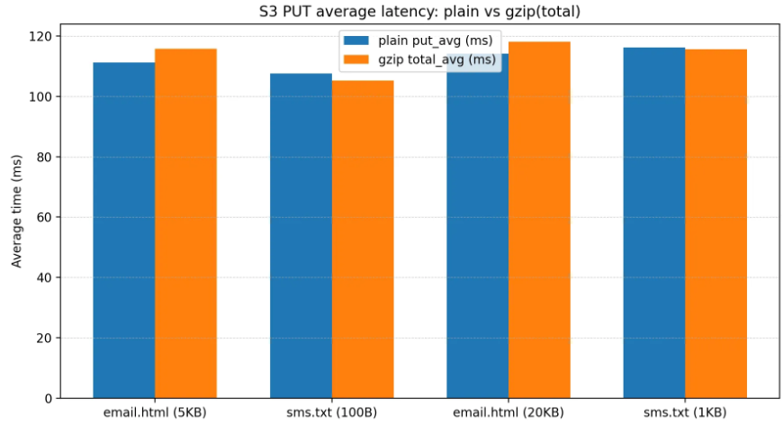
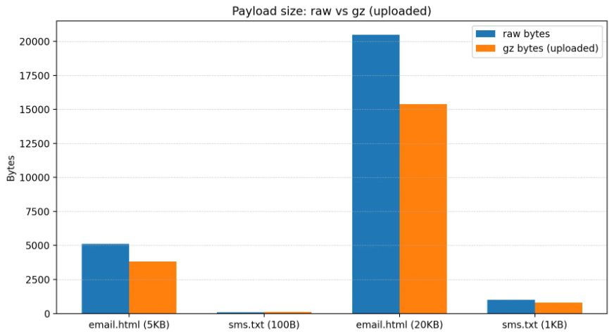

  <a class="tr1l-chip" href="https://github.com/marulog" aria-label="박준희 GitHub">
    
    박준희
  </a>

> #### 작성일 : 2026-02-06

---

# Performance Results

이 문서는 TR1L에서 성능을 **어떻게 측정했고**, **무엇을 바꿨고**, **어떻게 검증했는지**를 남깁니다.  
숫자가 아직 없더라도, 최소한 “측정 가능한 형태”로 남기는 게 목표입니다.

---

## 1) What was slow (병목)
- 병목 지점: S3 Put Object 업로드 
- 관찰된 증상
  - 업로드 평균 지연이 100ms대에서 유지되어 **파일크기, 자격인증, 네트워크 왕복, S3 서비스 처리**중 병목 요인이 있을 것이라 예상

---

## 2) Measurement (측정)
### Environment
- Region: **ap-northeast-2**
- S3 Bucket: **개인 계정 사용**
- App 실행 환경 : Docker 컨테이너에서 제한을 걸어 실제 서버 환경과 유사하게 진행
  - CPU: **1 vCPU**
  - Memory: **2GB**
- **테스트 목적**
  - 위의 병목 현상의 요인 중 파일 크기로 인해 지연 시간이 증가할 것이라 예상
  - 파일 크기를 줄이는 **압축(gzip)**이 실제 S3 업로드 지연을 변화시키는지 확인
  - 동시에 압축으로 **전송 바이트**가 작아짐에 따라 속도 변화 분석

### Dataset scale
- **데이터 타입 2종**
  - email.html(약 50KB)
  - sms.txt(약 80Bytes)
- **방법 2종**
  - Plain: 원본 그대로 업로드
  - Gzip: gzip을 사용하여 압축 후 업로드

### Metrics(측정 지표) 
- **plain_put_avg (ms)**: 원본 바이트 업로드 평균 지연
- **gzip_total_avg (ms)**: `gzip 압축 시간 + PutObject 업로드 시간` (End-to-End 평균)
- **payload bytes (B)**: 업로드한 객체 바이트 크기(Plain vs Gzip)

### Repetition (반복 조건)
- Warmup: 20회 (JVM/JIT, SDK 초기화, 커넥션 준비 등 초기 편차 제거)
- Runs: 100회 (평균 안정화 및 네트워크 변동성 완화)
- Size: 100Byte ~ 50KB (다양한 파일 크기에 따른 변화 분석)

---

## 3) What we changed (개선)
- 변경 사항:
  - Job2의 Writer에서 업로드 전 gzip 압축 적용(Plain vs Gzip)

---

## 4) Results (결과)

### 4-1. 평균 업로드 시간

<figure class="tr1l-figure">
  
  <figcaption>s3_gzip_speed</figcaption>
</figure>

- **email.html(50 KB)**
  - **Plain**: plain_put_avg = **114.110 ms**
  - **Gzip**: gzip_total_avg = **118.091 ms**
  - **Diff**: **+3.981 ms (+3.49%)**

- **sms.txt (80 Byte)**
  - **Plain**: plain_put_avg = **116.230 ms**
  - **Gzip**: gzip_total_avg = **115.569 ms**
  - **Diff**: **-0.661 ms (-0.57%)**
- **해석**
  - Plain과 Gzip 두 타입 모두 평균 업로드 시간이 100~116ms 범위로 유지됨
  - 병목현상이 파일 크기보다는 **자격인증, 네트워크** 등의 고정 비용 성격으로 추정됨

### 4-2. 데이터 크기(전송 바이트) 변화
<figure class="tr1l-figure">
  
  <figcaption>s3_gzip_size</figcaption>
</figure>

- **email.html**
    - 50KB → **2KB**
    - **48KB 절감 (약 96.00% 감소)**
- **sms.txt**
    - 87Byte → **100Byte**
    - **+13Byte 증가 (약 14.84% 증가)**
- **해석**
    - email은 텍스트 기반(HTML)이라 gzip 압축 효율이 높아 **전송 바이트가 감소**함
    - sms처럼 매우 작은 파일은 gzip 포맷의 **헤더/트레일러 오버헤드**가 상대적으로 커서, 오히려 **압축 후 크기가 증가**할 수 있음

> 결론(비용/전송량 관점):  
> **속도 개선은 없었지만**, 업로드되는 바이트가 유의미하게 감소함    
> →  대규모 트래픽/대량 발송 환경에서는 **네트워크 전송량/저장 비용 측면의 이점**이 있음.

### 4-3. Summary Table
| Metric                     | Before (Plain) | After (Gzip) | Improvement |
|---------------------------|---------------:|-------------:|------------:|
| email upload avg (ms)     |     114.110 ms |   118.091 ms |      -3.49% |
| sms upload avg (ms)       |     116.230 ms |   115.569 ms |      +0.57% |
| email payload size        |           50KB |          2KB |     +96.00% |
| sms payload size          |            87B |         100B |     -14.94% |
---

## 5) Artifacts (증거 링크)
- 지표에 사진 첨부

---

## 6) Next (다음 병목)
- 다음 개선 후보: 병렬 업로드 및 S3 Client 커넥션 및 동시성 튜닝
- 검증 계획: 
  - 동기 클라이언트를 업로드 부분만 Non-Blocking 병렬처리 후 처리시간, Tx, Rx 지표 분석
  - 위의 개선점에 따른 커넥션 및 청크 사이즈 튜닝을 통한 최적화 지점 탐색 예정
